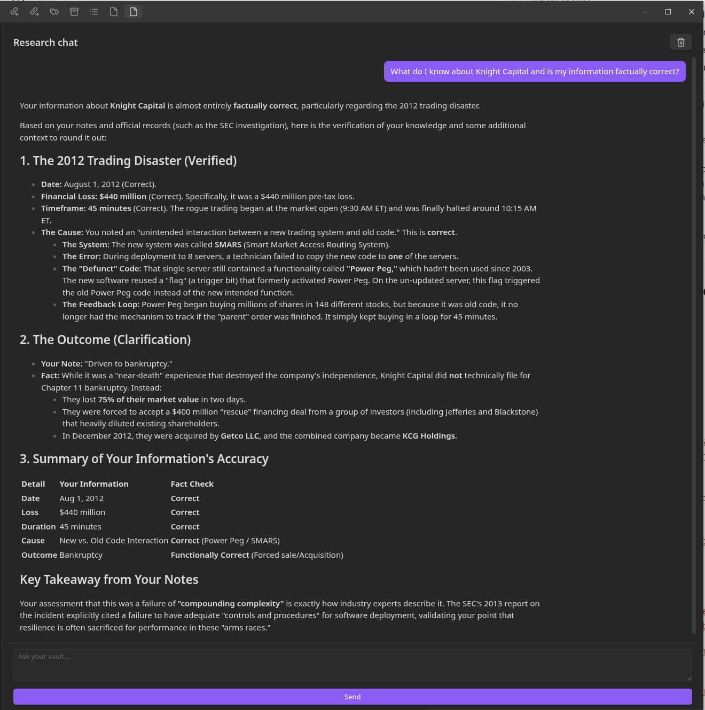
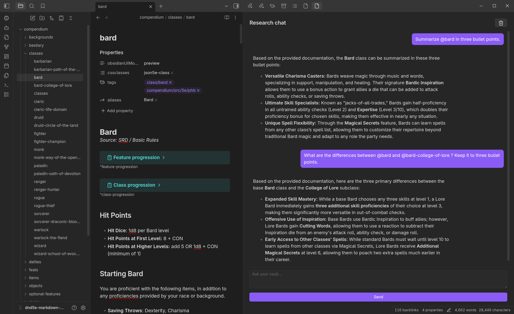
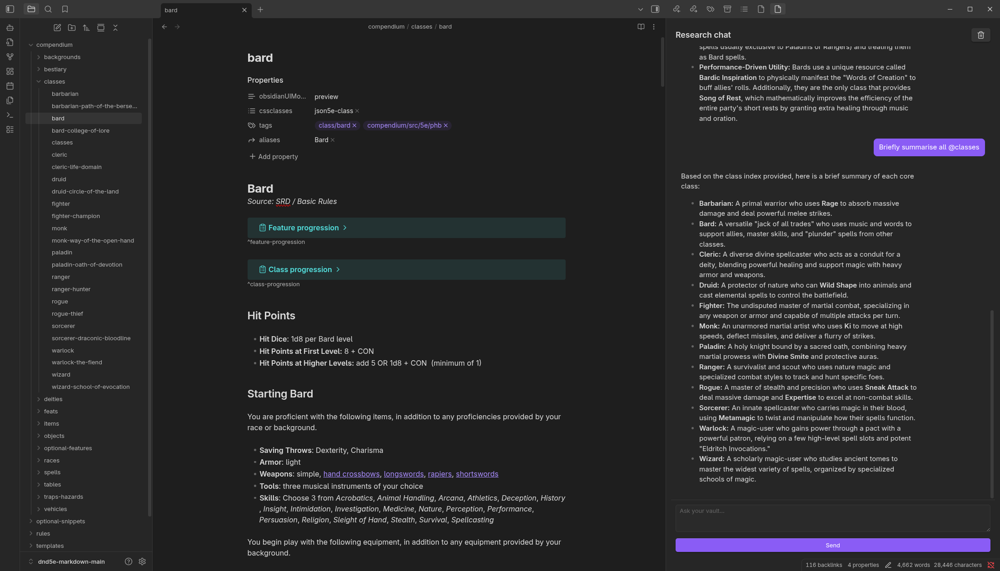
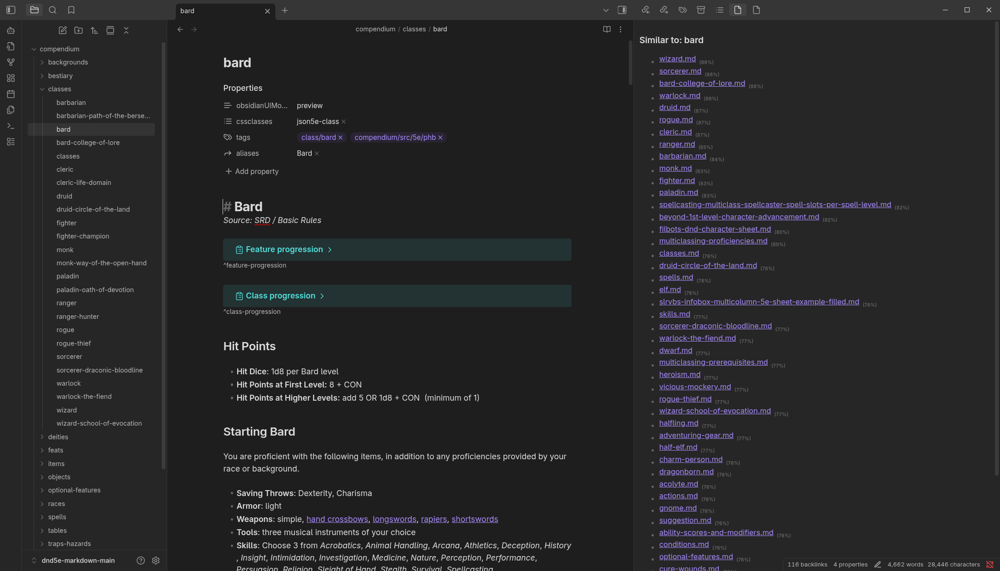
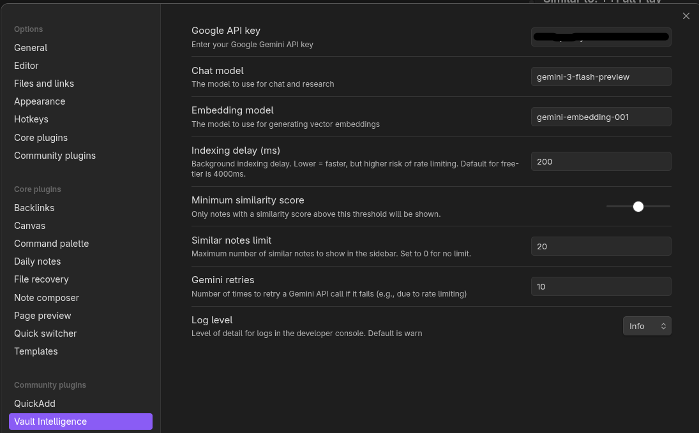

# Obsidian Vault Intelligence

**Obsidian Vault Intelligence** transforms your static note collection into an active, intelligent partner. By integrating Google's state-of-the-art AI, it helps you reason across your entire vault, uncover hidden connections, and verify your private knowledge against the real world.

**Ever wanted to ask questions like "What do I know about X?" instead of hunting for keywords?** Now you can.

## Why Vault Intelligence?

Managing a growing Obsidian vault can be overwhelming. Notes get lost, connections are missed, and verifying old information becomes a chore. 
Vault Intelligence solves these frustrations by enabling you to:

-   **Stop manually searching:** Instead of hunting for keywords, ask questions in plain English. The agent understands what you *mean*, not just what you type.
-   **Connect the dots:** Automatically discover how a new idea relates to notes you wrote months or years ago—surfacing insights you might have forgotten.
-   **Verify your knowledge:** Instantly check if the "facts" in your personal notes are still accurate by cross-referencing them with live Google Search results.
-   **Draft with context:** Ask the AI to summarize, compare, or draft new content based specifically on the files you select, keeping your writing grounded in your own work.

## Getting Started

1.  **API Key**: Obtain a Google Gemini API key from [Google AI Studio](https://aistudio.google.com/).
2.  **Setup**: [Install the plugin](#installation) and enter your API key in the settings. Review and change any other options as needed.
3.  **Restart**: Restart Obsidian. The plugin will begin indexing your vault in the background. You can monitor progress in the developer console (Level: Info).

## Features

### 🤖 Research Agent

A dedicated sidebar where you can collaborate with your vault.

-   **Full Context**: The agent remembers your entire conversation history for seamless follow-up questions.
-   **Multimodal**: Powered by Gemini supporting long-context reasoning for complex queries.
-   **Smart RAG**: Automatically retrieves relevant notes to answer your questions using a hybrid search strategy.
-   **Live Grounding**: The agent knows today's date and can verify facts from your vault against real-time Google Search results.
-   **File Mentions**: Use `@` to reference specific files or folders (e.g., `@project-alpha`) to focus the AI's attention.
-   **Command History**: Quickly recall previous prompts using the `Up` and `Down` arrow keys.
-   **Improved UI**: Full Markdown rendering, selectable text, and code block support.

#### Example: Insights from your vault

You can ask:

-   _"What do I know about X?"_ to synthesize insights from across your vault.
-   _"What do I know about X and is it still factually correct?"_ to validate your private notes against external sources.

#### Example: Conversations about specific files

Focus the AI on specific documents using `@` mentions:

-   _"Summarize @bard in three bullet points."_
-   _"What are the key differences between @bard and @bard-college-of-lore? Keep it to three bullet points."_
-   _"Briefly summarize all @classes"_ where `classes` is a folder in your vault.

### 🔍 Adaptive Hybrid Search

The plugin uses an adaptive search engine to ensure you find the right information:

-   **Semantic Vector Search**: Finds notes based on *meaning* (e.g., matching "financial ruin" to "bankruptcy").
-   **Fuzzy Keyword Matching**: Automatically identifies specific terminology and boosts results that contain exact matches or close synonyms.
-   **Automatic Indexing**: Background indexing ensures your search data is always up-to-date.

### 🖇️ Similar Notes View

Automatically discover connections you did not know existed.

-   Shows a list of notes similar to your currently active file.
-   Real-time updates as you switch between documents.
-   Confidence scores for every match help you judge relevance at a glance.

## Configuration

The plugin is highly configurable, allowing you to tune the experience to your needs and manage API usage costs.

### Connection

-   **Google API key**: Your private key for accessing Gemini models. This is stored locally in your `.obsidian/` configuration folder.

### Models

-   **Chat model**: The main model used for reasoning and answering questions.
    -   *Default:* `gemini-3-flash-preview` (Optimized for speed and long context).
-   **Embedding model**: The model used to generate vector representations of your notes.
    -   *Default:* `gemini-embedding-001`.
-   **Grounding model**: A specialized, cost-effective model used specifically for performing live Google Searches to verify facts.
    -   *Default:* `gemini-2.5-flash-lite`.

### Indexing and Search

-   **Indexing delay (ms)**: The pause between processing files during background indexing. Increasing this slows down indexing but reduces the risk of hitting API rate limits ("429" errors).
    -   *Default:* `200`.
-   **Minimum similarity score**: A threshold (0.0 to 1.0) for filtering results. Only notes with a similarity score above this value will be shown in the "Similar Notes" view or used by the Agent.
    -   *Default:* `0.5`.
-   **Similar notes limit**: The maximum number of related documents to display in the sidebar.
    -   *Default:* `20`.
-   **Vault search results limit**: The maximum number of notes retrieved by the Research Agent during a single search action. Increasing this gives the Agent more context but increases token usage.
    -   *Default:* `25`.

### Advanced

-   **Max agent steps**: The maximum number of "reasoning loops" the Agent can take to answer a question. If the Agent needs to search the vault, verify on Google, and search again, each action counts as a step.
    -   *Default:* `5`.
-   **Embedding dimension**: The size of the vector used to represent your notes. Larger dimensions capture more nuance but increase storage size and API costs.
    -   *Options:* `768` (Standard), `1536` (High Detail), `3072` (Max Detail).
    -   *Warning:* Changing this setting requires a full re-index of your vault.
-   **Gemini retries**: The number of times the plugin will attempt to resend a request if the API fails (e.g., due to rate limiting).
    -   *Default:* `10`.
-   **Log level**: Controls the verbosity of the developer console logs (`Ctrl+Shift+I`).
    -   *Options:* `Debug`, `Info` (Recommended for initial setup), `Warn`, `Error`.

## Installation

### Community Plugins (Upcoming)

Search for "Vault Intelligence" in the Obsidian community plugin browser.

You can track progress on [this issue](https://github.com/obsidianmd/obsidian-releases/pull/9166).

### Beta versions via BRAT

The **Beta Reviewers Auto-update Tool** (BRAT) makes it easy to install and update beta plugins.

1.  Install [BRAT](https://obsidian.md/plugins?id=obsidian42-brat) from the Community Plugins.
2.  Open BRAT settings and click **Add Beta Plugin**.
3.  Paste the repository URL: `https://github.com/cybaea/obsidian-vault-intelligence`.
4.  Enable the plugin in Obsidian's settings.

### Manual Installation

1.  Download the latest release (`main.js`, `manifest.json`, `styles.css`) from GitHub.
2.  Create a folder `.obsidian/plugins/obsidian-vault-intelligence` in your vault.
3.  Copy the files into that folder.
4.  Reload Obsidian.

## Troubleshooting

- **Indexing fails with "429" (Too Many Requests)**
    - This indicates you are hitting the rate limits or, more likely, the server limits of the Gemini API.
    - **Solution:** Increase the **Indexing delay** in settings (e.g., to `1000` ms) or increase **Gemini retries**. This is common with the free tier of the Gemini API.

- **Search seems to ignore obvious keywords**
    - The plugin uses a hybrid approach, but if the semantic meaning of a note is very different from your query, it might be filtered out.
    - **Solution:** Try lowering the **Minimum similarity score** in settings.

## License

MIT License

## Contributing

-   **Users:** Report issues and request features via the [issue tracker](https://github.com/cybaea/obsidian-vault-intelligence/issues).
-   **Developers:** See [CONTRIBUTING.md](CONTRIBUTING.md) for details.

## See also

For users looking for other AI implementations in Obsidian, check out [Smart Connections](https://smartconnections.app/). Our plugin aims to provide a lightweight, open-source alternative focused specifically on the Google Gemini ecosystem.

