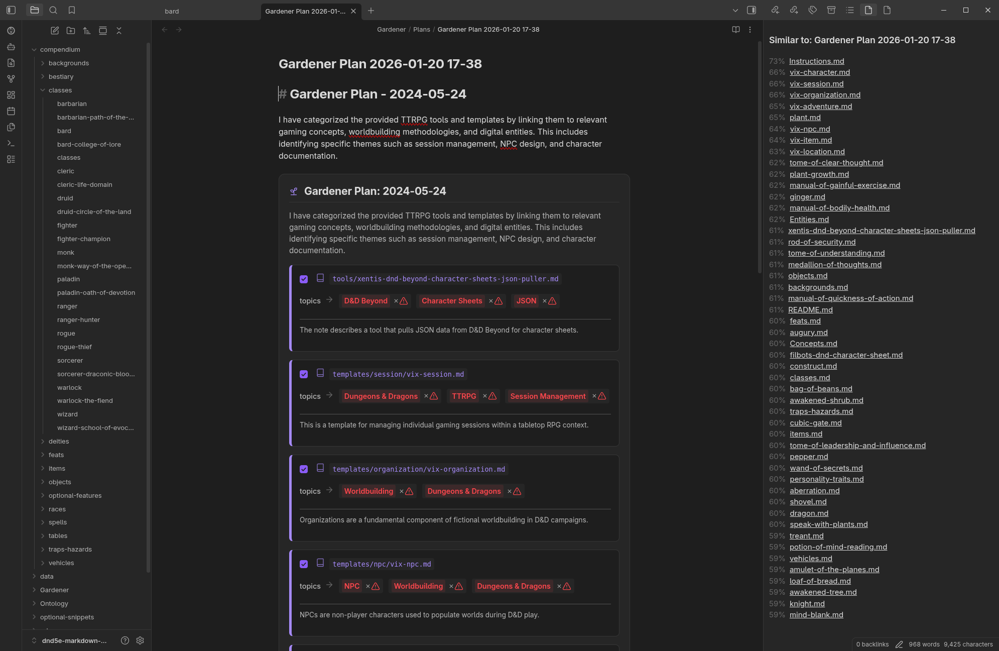

# Obsidian Vault Intelligence

**Transform your Obsidian vault from static storage into an active, intelligent partner.**

Vault Intelligence integrates state-of-the-art Gemini 3 models to help you reason across your entire knowledge base, uncover hidden connections, and verify your private notes against the real world.

**Ever wanted to ask, *"What do I know about X?"* instead of hunting for keywords?**

Now you can. The agents understand what you *mean*, not just what you type.

Examples:

- **[Knowledge retrieval](docs/examples.md#knowledge-retrieval)**: _What do I know about Knight Capital?_ (Personal vault).
- **[Knowledge verification](docs/examples.md#knowledge-verification)**: _What do I know about RAG and is my information comprehensive, factually correct, and up to date?_ (Personal vault and Google Search).
- **[Computational solver](docs/examples.md#computational-solver)**: _Read @"Monthly Expenses" . Group the data by month to find the total Q4 spend and forecast my January total based on the trend._ (Personal vault with Python code execution). You can even plot the data.
- **[Document context](docs/examples.md#document-context)**: _Briefly summarise @bard._ (Single document; D&D 5e vault).
- **[Multiple documents](docs/examples.md#multiple-documents)**: _Briefly compare @bard with @bard-college-of-lore _. (Multiple documents; D&D 5e vault).
- **[Folder context](docs/examples.md#folder-context)**: _Briefly summarise all @classes _. (Multiple documents in a folder; D&D 5e vault).
- **[Similar documents](docs/examples.md#similar-documents)**: Shows related notes for the current document in a sidebar (D&D 5e vault).

---

## The vision

We believe knowledge management should be active, not passive. Your vault shouldn't just store ideas—it should help you develop them.

See our **[Roadmap](ROADMAP.md)** to explore our journey toward autonomous research, multimodal analysis, and agentic workflows.

---

## Why Vault Intelligence?

Managing a growing vault is hard. Notes get lost, facts get outdated, and connections are missed. Vault Intelligence solves this by enabling you to:

-   **Chat with your notes:** Ask complex questions like *"How has my thinking on Project Alpha evolved?"* to synthesize insights across hundreds of files.
-   **Verify facts:** Instantly cross-reference your private notes with live Google Search results to check accuracy.
-   **Analyze your data:** Use the integrated **Computational Solver** to extract tables or logs from your notes and run real Python analysis (forecasting, trends, statistics) directly in the chat.
-   **Connect the dots:** Automatically discover related notes you wrote months ago, surfacing insights you might have forgotten.

## Key features

### Researcher

Your intelligent partner for discovery, reasoning, and data analysis.

- **Deep context**: Uses a "Greedy Packing" engine to read **full documents** (up to 200k tokens), understanding the nuance of long reports rather than just snippets.
- **Computational solver**: A specialised sub-agent that writes and executes Python code. Perfect for analysing personal data, such as _"Read my @Expenses note and forecast next month's spend based on the Q4 trend"_ or _"Plot my weight loss progress from my @Journal entries."_
- **Live grounding**: Verifies claims against real-time Google Search data.
- **Smart context**: Use `@` to mention specific files (e.g., `@meeting-notes`) or folders to focus the AI's attention.

🔽🔽🔽 <strong>Click to see the Researcher in action</strong> 🔽🔽🔽

Prompt: _What do I know about RAG and is my information comprehensive, factually correct, and up to date?_

### Gardener

A proactive agent dedicated to maintaining your vault's structure and consistency.

- **Organise vault concepts**: Analyses your notes to suggest improvements and refine your [ontology](docs/gardener.md).
- **Proactive hygiene**: Identifies missing topics and link opportunities across your entire knowledge base.
- **Safety first**: Operates on a "plan-review-apply" model. You always review a temporary Markdown plan before any changes are made to your notes.

🔽🔽🔽 <strong>Click to see the Gardener in action</strong> 🔽🔽🔽

### Adaptive hybrid search

Finds the right note, even if you use the wrong words.

- **Semantic search**: Matches meaning (e.g., "financial ruin" finds "bankruptcy").
- **Fuzzy keyword matching**: Boosts exact phrase matches for precision.
- **Automatic indexing**: Your vault is re-indexed in the background as you work.

### Explorer

- **Active discovery**: Shows a dynamic list of notes related to your _current_ open file.
- **Confidence scores**: Clearly indicates how relevant each connection is.

🔽🔽🔽 <strong>Click to see the Explorer sidebar</strong> 🔽🔽🔽

---

## Network use

To provide intelligent reasoning and search capabilities, this plugin uses external network services. In compliance with [Obsidian developer policies](https://docs.obsidian.md/Developer+policies), here is a clear explanation of how and why network access is used:

- **Google Gemini API** (`https://generativelanguage.googleapis.com`): Processes your notes for chat, reasoning, and semantic search. It also powers the **Google Search Grounding** and **Computational Solver** (Python execution) features.
- **Hugging Face** (`https://huggingface.co`): Used to download open-source embedding models (e.g., Nomic, BERT) for **local processing** when you prefer not to send note content to an external API for indexing.
- **jsDelivr** (`https://cdn.jsdelivr.net`): Downloads the WebAssembly (WASM) runtimes required to execute the embedding models locally within Obsidian.
- **User-Initiated Web Access**: Use of the **URL Reader** tool (via the Researcher) will trigger a request to the specific URL you provide to retrieve its content for the AI to analyze.

> [!NOTE]
> All note content used for indexing or chat is only sent to the service provider (Google) if you use the cloud-based Gemini models. Local models downloaded from Hugging Face run entirely on your device.

---

## Getting Started

1.  **Install**: Search for "Vault Intelligence" in the Obsidian Community Plugins gallery (or use [BRAT](https://github.com/TfTHacker/obsidian42-brat)).
2.  **API Key**: Obtain a free API key from [Google AI Studio](https://aistudio.google.com/).
3.  **Configure**:
    - Enter your API key in **Settings > Vault Intelligence**.
    - Choose your **Embedding Provider**: 
        - Choose `Google Gemini` for multi-lingual support, low local compute requirements (ideal for mobile), and best accuracy and ease of use.
        - Choose `Local` if you prefer 100% privacy and offline functionality.
4.  **Activate**: Click the **Vault Intelligence** ribbon icon (looks like a robot) to access your agentic team:
    - Select **Researcher: chat with vault** to start a conversation with your notes.
    - Select **Explorer: view similar notes** to see real-time connections in a sidebar as you work.
    - Use the command palette (`Ctrl/Cmd + P`) and search for **Gardener: organize vault concepts** to maintain your vault's structure.

> [!TIP]
> Check the **[Configuration Guide](docs/configuration.md)** to optimize performance for your device, especially if using the local provider on mobile or older hardware.

## Configuration & documentation

The plugin is designed to work out-of-the-box, but is highly customizable.

* **[Configuration Guide](docs/configuration.md)**: Detailed explanation of every setting (Models, Context Window, Embeddings).
* **[Example Prompts](docs/examples.md)**: A "Cookbook" for advanced reasoning, data analysis, and fact-checking.
* **[Troubleshooting](docs/troubleshooting.md)**: Fixes for "429 Too Many Requests" and other common issues.

🔽🔽🔽 <strong>Click to see the Settings Panel</strong> 🔽🔽🔽

---

## Contributing
We welcome contributions!
-   **Users:** Report issues on [GitHub Issues](https://github.com/cybaea/obsidian-vault-intelligence/issues).
-   **Developers:** Read [CONTRIBUTING.md](CONTRIBUTING.md) and check the [Roadmap](ROADMAP.md) for "Good First Issues."

**License:** MIT
