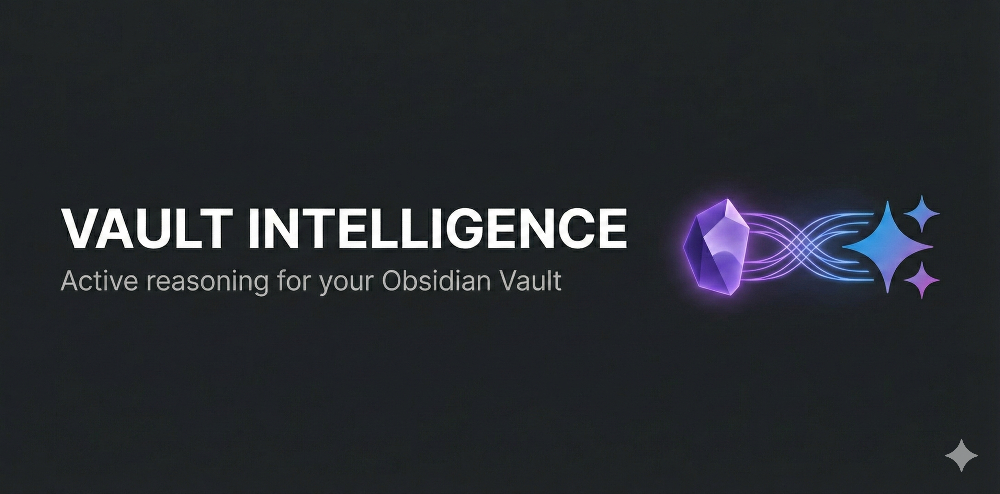

# Obsidian Vault Intelligence

     

   

## Don't just query your vault. _Maintain it._

Vault Intelligence is a different AI plugin for Obsidian. It transforms your vault into a dynamic, self-maintaining knowledge system. It goes beyond simple Q&A by introducing agents that maintain your vault's structure, retrieve information based on your explicit connections, and ground your knowledge in the real world.

Obsidian vaults naturally degrade. As facts change, your notes become outdated. As the vault grows, connections are forgotten and tagging becomes inconsistent. Standard AI plugins function as search engines for this static data.

**Vault Intelligence functions as a maintenance system. It identifies gaps in your notes by cross-referencing your writing with live web searches. It retrieves information based on the explicit structural links you built, rather than just matching text. It audits your tags to connect notes to existing topics, proposing new ones when needed. It connects to external tools—like local scripts or databases—under strict cryptographic security.**

-   100% Local, Offline capability: Vault Intelligence can use API models or it can run entirely offline using local embeddings via Transformers.js and local language models via Ollama. Your data never has to leave your device.

It is designed to keep your knowledge current, connected, and secure.

Vault Intelligence is **free** and **open source**.

## Why use Vault Intelligence?

Standard AI plugins retrieve text. Vault Intelligence is designed to actively maintain and update your knowledge base.

-   **Refresh outdated knowledge:** Notes become obsolete as facts change. Ask the agent to read your existing files on a topic, run a live web search to find recent developments, and draft an update to bridge the gap between your archived notes and current reality.
-   **Retrieve context, not just text:** Using Graph Retrieval-Augmented Generation (Graph RAG), the plugin reads the explicit links connecting your files and topics. It retrieves information based on how you structured your ideas, finding relevant concepts even if they use different terminology.
-   **Automate vault organisation:** Maintaining consistent tags and links across thousands of files is unmanageable. The Gardener agent audits your notes against your topics, suggests new ones only when needed, and provides an actionable checklist of missing links to keep your taxonomy intact.
-   **Execute external tools securely:** Connect local databases or scripts using the Model Context Protocol (MCP). To prevent unauthorised code execution, the plugin operates within strict cryptographic and environmental boundaries, requiring explicit approval before modifying any file.

See also [Strategic Positioning](docs/explanation/strategic-positioning.md) and [Competitor Comparison](docs/explanation/competitor-comparison.md).

## How It Works for you

To achieve this, we built Vault Intelligence around four distinct personas that act as stewards of your knowledge:

**1. The Explorer (Finding the Hidden Threads)**

Traditional search is a "bag of words." If you search for "automobile," it won't find notes about "cars." The Explorer understands _meaning_. By combining state-of-the-art semantic vector search with your graph's structural connections, it finds the invisible threads between your ideas. It knows that two notes are related not just because they share text, but because they share a conceptual sibling in your personal ontology. It brings serendipity back to your research.

**2. The Researcher (Your Intellectual Partner)**

Imagine having a research assistant who has memorized every note you’ve ever written. The Researcher doesn't just answer questions; it grounds its reasoning entirely in your vault. If it needs to crunch numbers, it can write and execute Python code. If it needs to verify a real-world fact, it can search the web. But crucially, it is bound by your context. It reads your files, understands your specific terminology, and can even draft or update notes—always asking for your final approval via a "Trust but Verify" prompt before writing a single word.

**3. The Gardener (The Guardian of Your Graph)**

A garden left untended becomes a jungle. The Gardener is a proactive agent that understands your personal ontology. It works in the background, analyzing your notes to find missing tags, suggesting new conceptual links, and proposing structural improvements. It never alters your files silently. Instead, it generates an interactive "Gardening Plan" for you to review, approve, or reject. It takes the chore out of Personal Knowledge Management.

**4. The Solver (Advanced Analysis in your Vault)**

Words are only half the story. If you track habits, log expenses, or compile research data in Markdown tables, that information usually sits dead on the page. The Solver brings it to life. When faced with a complex analytical question, it doesn't just guess—it acts as your personal data scientist. It can read your structured data, write Python code, and execute it inside a secure sandbox to crunch numbers, calculate trends, and forecast outcomes right inside your chat window. It turns static logs into actionable insights.

---

## How It Works (The Technical Edge)

To make this seamless, Vault Intelligence uses a "Slim-Sync" Hybrid Architecture rather than acting as a standard LLM wrapper:

-   **Flexible Privacy** (Local or Cloud): Choose how your vault is mapped. Use the default Gemini embeddings for unmatched multilingual support and mobile performance, or switch to 100% local WASM embeddings to ensure your raw notes never leave your device.
-   **Zero Sync Bloat**: Full vector indexes are kept in your device's local IndexedDB, while only a feather-light blueprint is synced across your devices.
-   **Dynamic Context**: An "Accordion" assembly system dynamically scales from reading full documents to just reading headers, ensuring the AI never hallucinates due to context overload.
-   **Rigorous Security**: We implement a strict "Human-in-the-Loop" model with SSRF protection, command injection prevention, and cryptographically signed tool configurations. Read our **[Security and Robustness Standards](https://cybaea.github.io/obsidian-vault-intelligence/devs/security-and-robustness)** for the full technical breakdown.

---

## Documentation

-   [**Getting Started**](https://cybaea.github.io/obsidian-vault-intelligence/docs/tutorials/getting-started): Connect your API key and run your first query in 5 minutes.
-   [**How-To Guides**](https://cybaea.github.io/obsidian-vault-intelligence/docs/how-to/researcher-workflows): Master specific workflows like data analysis and context management.
-   [**Reference & Troubleshooting**](https://cybaea.github.io/obsidian-vault-intelligence/docs/reference/configuration): Detailed configuration options.
-   [**Explanation**](https://cybaea.github.io/obsidian-vault-intelligence/docs/explanation/research-engine): Understand the Hybrid Search and GARS engine.

## Installation

Currently available in Beta via BRAT:

1.  Install **BRAT** from the Community Plugins store.
2.  In BRAT settings, click **Add Beta plugin**.
3.  Enter: `https://github.com/cybaea/obsidian-vault-intelligence`
4.  Enable Vault Intelligence in your Community Plugins list.

## Contributing

We welcome contributions from developers, designers, and prompt engineers! 

🛠️ **Developers:** Please read our **[Architecture & Standards Guide (`ARCHITECTURE.md`)](ARCHITECTURE.md)** and our **[Security and Robustness Standards (`security-and-robustness.md`)](devs/security-and-robustness.md)** before submitting a pull request to understand our Web Worker constraints, strict SSRF protections, and internal API contracts.

See [CONTRIBUTING.md](CONTRIBUTING.md) for general guidelines.

**License:** MIT
