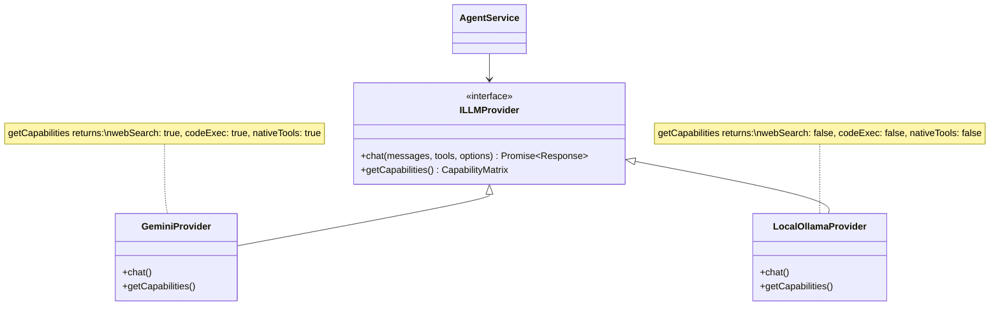
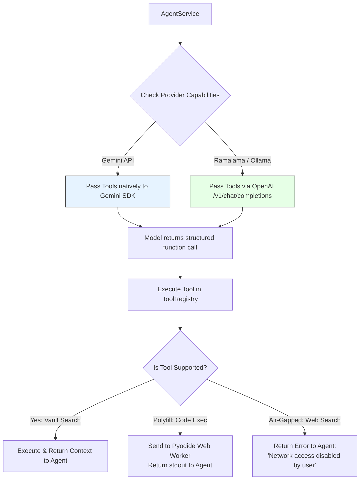
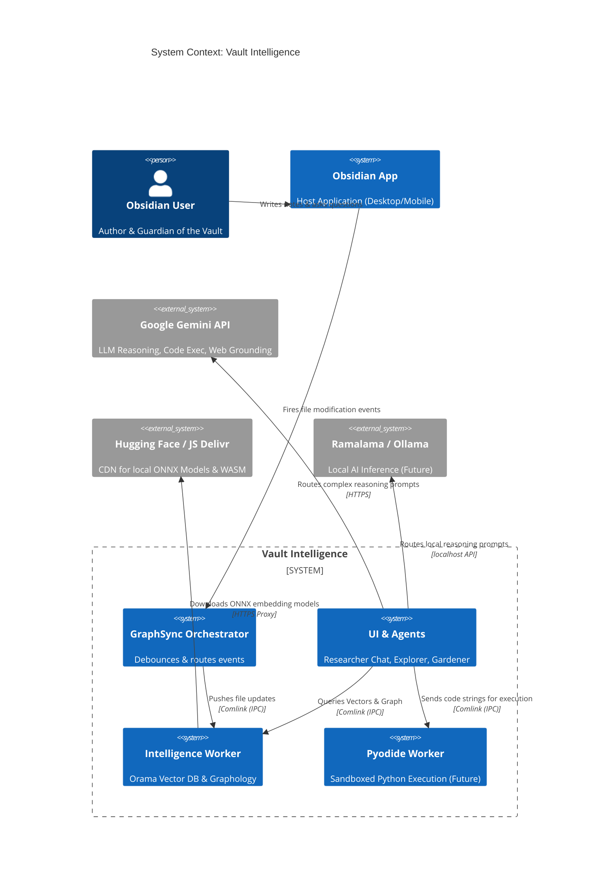
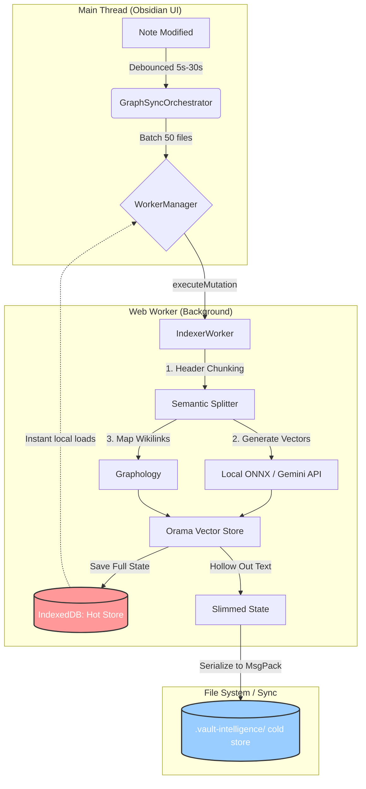
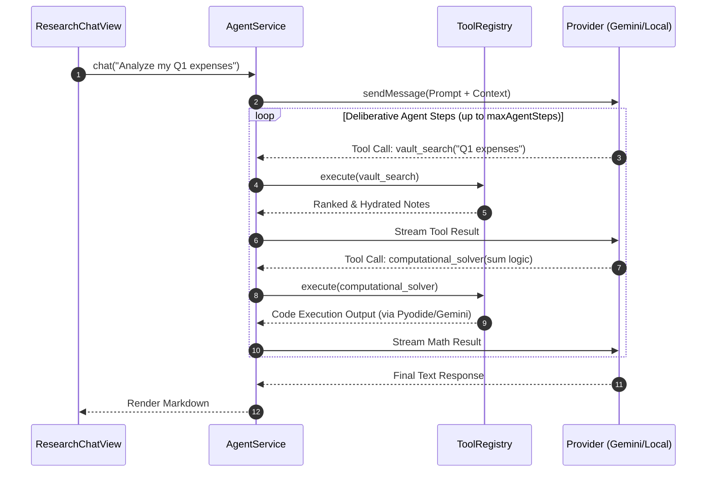
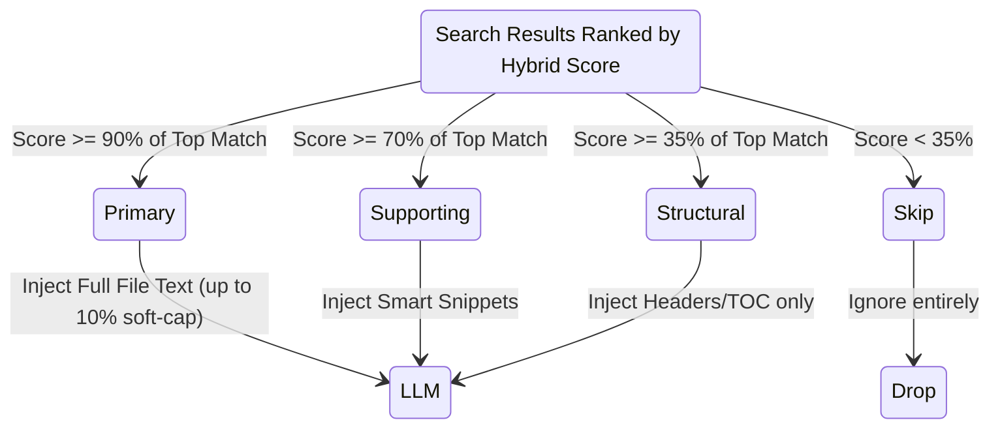
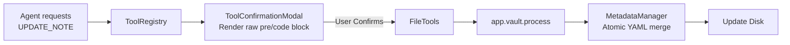
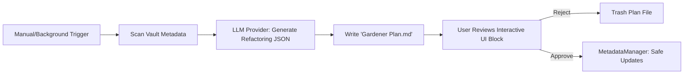

# Vault Intelligence: The Architecture of an Agentic Knowledge Graph

**Version**: 7.0.x | **Status**: Active Evolution

**Audiences**: Product Managers, Marketers, Systems Architects, Designers, and Developers

Welcome to the heart of **Vault Intelligence**. We didn't just build a search tool or a simple LLM chat wrapper; we built a localized, graph-aware intelligence engine that lives entirely within your Obsidian vault.

This document serves as our blueprint and our manifesto. Whether you are a **Marketer** crafting our story, a **Product Manager** charting our roadmap, an **Architect** studying our systems, or a **Developer** writing your first pull request, this guide will show you _what_ we built, _how_ it works, and most importantly, _where_ we are going.

---

## 1. The Value Proposition (For Marketing & Product)

To get people excited about Vault Intelligence, we have to translate our deep technical architecture into compelling user benefits and product advantages.

### For Marketing: Translating Tech to User Benefits

Most AI tools for notes are "dumb wrappers"—they take your search, stuff it into a prompt, and hope for the best. Vault Intelligence is different. It is a **sovereign, active co-pilot**.

-   **The Architecture:** _The "Slim-Sync" Hybrid Storage Engine._
    
    -   **The Marketing Message:** **"Lightning fast on mobile, zero sync bloat."** We store the heavy AI data locally on your device and only sync a feather-light blueprint across your vault. You get enterprise-grade AI without devouring your iCloud or Obsidian Sync storage limits.
        
-   **The Architecture:** _Hybrid Processing (Local WASM Embeddings + Cloud Gemini Reasoning)._
    
    -   **The Marketing Message:** **"Private memory, frontier cognition."** We give you the best of both worlds. The heavy lifting of vectorizing and mathematically mapping your vault happens 100% offline and for free on your own device (so your raw notes are never sent to a server just to be searched). Then, we securely route only the most relevant snippets to Google Gemini for reasoning. This ensures you get world-class multilingual chat, complex Python code execution, and live web-search, all while running flawlessly—even on your mobile phone. _(Note: Full local offline reasoning is on our roadmap!)_
        
-   **The Architecture:** _Relative "Accordion" Context Assembly._
    
    -   **The Marketing Message:** **"An AI with perfect memory and zero noise."** Our agent reads exactly what it needs—scaling dynamically from full documents, to tiny snippets, to just reading the headers. It never "forgets" important details or hallucinates due to context overload.
        
-   **The Architecture:** _Agentic Tool Loop & Gardener Pattern._
    
    -   **The Marketing Message:** **"An automated librarian you can trust."** Vault Intelligence doesn't just chat; it acts. It can execute Python code, search the live web, and proactively suggest tags for your notes—but it _never_ modifies your files without your explicit approval via visual diffs.

### For Product Managers: Our Competitive Edge

**Why this project wins today:** Competitors fall into two traps: they either bloat the vault with massive hidden JSON files that ruin mobile syncing, or they require users to set up complex local LLM servers that drain laptop batteries and flat-out fail on iOS/Android.

Vault Intelligence wins because it is a **Pragmatic Hybrid**. It maintains a mathematical understanding of your vault (Graphology + Orama) inside a background Web Worker locally, achieving zero UI latency. By outsourcing heavy cognitive tasks (Tool use, Python execution, Web Grounding) to Gemini, the plugin runs flawlessly on constrained mobile devices and supports dozens of languages out-of-the-box.

## 2. Strategic Roadmap: Architecting Sovereign Local LLMs

**The Current State:** We require a Google Gemini API key for the reasoning engine. Gemini provides a robust, native framework for function calling (Tools), code execution (Python sandbox), and web search (Grounding).

**The Goal:** Support local LLM inference engines (specifically **Ramalama** and **Ollama**) to enable a 100% air-gapped, offline agent option for privacy-first power users.

**The Pivot:** Local models are strictly inference engines—they output text. They do not have built-in secure Python sandboxes or live Google search indices. To support local models securely and scalably, we are implementing an **OpenAI-Compatible Abstraction Layer** paired with **Secure Local Polyfills**.

### Phase 1: The `ILLMProvider` Abstraction & Native Tool Calling

We are dropping the outdated practice of injecting `<tool_call>` XML tags and parsing streams with Regex. Modern engines (Ramalama/Ollama) spin up OpenAI-compatible API servers by default (`/v1/chat/completions`) and utilize underlying GBNF (Grammar-Based Network Format) to guarantee JSON structure.

We will extract an interface that standardizes how the agent requests chat and passes our `ToolExecutionParams` directly into the standard `tools` array. Modern local models (like Llama 3.3 or Qwen 2.5) are already fine-tuned to handle this natively.

### Phase 2: Secure Tool "Polyfills"

Because local models lack Google's native tools, we must build local equivalents ("polyfills") that the plugin executes on behalf of the model.

#### A. Web Search: Strict Offline vs. Bring-Your-Own-Key (BYOK)

We will not use brittle, rate-limited free HTML scrapers (like DuckDuckGo Lite). We must be explicit with users about what "Local" means to them:

-   **Absolute Local (Air-Gapped):** If the user wants zero internet traffic, the `google_search` tool is completely disabled in the capabilities matrix. The agent relies _only_ on the vault.
  
-   **Private Inference, Public Data:** If the user wants private AI inference but needs live web data, we will implement a BYOK (Bring Your Own Key) model. Users can plug in an API key for **Tavily**, **Brave Search**, or point the plugin to a self-hosted **SearXNG** instance.

#### B. Code Execution: The Pyodide WASM Sandbox

Running raw Python generated by an LLM through Node/Electron on a user's local machine is a massive CVE risk. To support the `computational_solver` safely, we will spin up a dedicated Web Worker running **Pyodide** (Python compiled to WebAssembly).

**Architectural Limitations of the Pyodide Sandbox:**

Before we implement this, the team must understand the constraints of WASM Python:

1.  **No Native Sockets:** Pyodide runs in a browser sandbox. It cannot use native Python `requests` or `urllib`. Any network requests must be routed through `pyodide.http.pyfetch` (which relies on the browser's `fetch` API and is subject to strict CORS policies).
    
2.  **Package Constraints:** We can easily load pure Python packages and pre-compiled libraries like `numpy` or `pandas`. However, arbitrary C-extensions that haven't been ported to WASM will fail to install.
    
3.  **Memory & Startup Overhead:** The initial load of the Pyodide environment involves fetching ~10MB+ of WASM binaries. We will need to keep this worker alive during a chat session to avoid cold-start penalties on every code execution, meaning we must carefully manage memory limits.
    
4.  **Synchronous Blocking:** Python execution is synchronous. The Web Worker architecture is mandatory here so we do not freeze the Obsidian UI while the LLM runs a heavy Pandas dataframe operation.

### Phase 3: Capability Negotiation & Graceful Degradation

The UI and Agent must react dynamically to the selected model's capabilities.

---

## 3. High-Level Architecture (For Architects)

Vault Intelligence is designed using a **Service-Oriented Architecture (SOA)** adapted for a local client application.

### Core Principles

1.  **The "Brain vs. Body" Split:** The Main Thread (Obsidian UI) is the _Body_. It handles rendering and user input. The Web Worker is the _Brain_. It handles Orama (Vector DB), Graphology (Knowledge Graph), and Transformers.js. **The main thread must never block.**
    
2.  **Humble Views:** Our React-free UI components (`ResearchChatView`, `SimilarNotesView`) contain practically zero business logic. They dispatch intents to Singleton services (`AgentService`, `GraphService`) initialized in `main.ts`.
    
3.  **Safe Mutations:** All writes to the vault funnel through a centralized `MetadataManager` and `FileTools` using atomic `vault.process()` updates to prevent race conditions and preserve file integrity.

### System Context (C4 Level 1)

---

## 4. Deep Dive: Subsystems & Data Flows (For Developers)

To inspire you to contribute, let's look at _why_ our three core subsystems—**Explorer, Researcher, and Gardener**—are engineered the way they are.

### 4.1 The Explorer & The "Slim-Sync" Storage Architecture

Vector databases are huge. Storing a 50MB JSON file in an Obsidian vault causes mobile apps to crash and sync services to hang. We solved this with the **Slim-Sync** architecture via the `PersistenceManager`.

-   **Hot Store (IndexedDB):** Fast, local, un-synced storage where the full Orama index lives.
    
-   **Cold Store (MsgPack):** A highly compressed, content-stripped binary file saved to the vault (`.vault-intelligence`). It acts as a sync-able blueprint across your devices.

#### The Indexing Flow

### 4.2 The Researcher: Agentic RAG & Dual-Loop Search

The Researcher is an autonomous agent. When a user asks a question, we don't just dump search results into an LLM. We run a highly optimized **Dual-Loop Search** inside the `SearchOrchestrator`.

1.  **Loop 1 (Reflex):** Fast, local vector + keyword search (BM25) with Sigmoidal score calibration. Returns results in <50ms for immediate UI feedback ("Spotlight").
    
2.  **Loop 2 (Analyst):** (Deep Search) Uses a lightweight LLM call to re-rank results based on deep semantic meaning and graph centrality.

#### The Deliberative Tool Loop

#### Context Assembly (The "Relative Accordion")

LLMs have strict token limits, and stuffing them with useless text ruins their output. Our `ContextAssembler` evaluates the relevance of every document _relative to the top hit_.

### 4.3 Safe File Mutation (Write Operations)

To ensure the AI never destroys user data, write operations (like `UPDATE_NOTE` or `CREATE_NOTE`) follow a strict `Plan -> Confirm -> Execute` flow.

### 4.4 The Gardener & The Plan-Review-Apply Pattern

AI should never touch user data without supervision. The Gardener analyzes the vault's health (missing topics, broken links) based on your custom Ontology, but acts entirely through a "Trust but Verify" pattern. The Gardener relies on a strict `Zod` schema (`GardenerPlanSchema`) to ensure the LLM's JSON output doesn't break the UI.

---

## 5. Engineering & Security Guardrails

We designed this system to be bulletproof. As a developer contributing to this project, you must adhere to these established guardrails:

1.  **Strict SSRF Protection (`utils/url.ts`):**

    Because our Agent can read URLs from the web, we implemented strict Server-Side Request Forgery protections. The agent is hard-blocked from accessing loopback addresses (`localhost`, `127.0.0.1`), private IP ranges, and Cloud metadata endpoints (`169.254.169.254`), keeping the user's local network safe from prompt injection attacks.

2.  **No Ghost Nodes (`GraphSyncOrchestrator.ts`):**

    If a user renames a file, traditional indexers leave behind a "ghost." Our `vault.on('rename')` hook explicitly deletes the old path from the index before enqueuing the new path, ensuring the graph is always a 1:1 mirror of the file system.

3.  **Data Isolation (`PersistenceManager.ts`):**

    Different embedding models (e.g., Gemini vs Local ONNX) store their data in cryptographically isolated shards (`graph-state-[hash]`). Switching models will never corrupt the user's index.

4.  **WASM Fetch Proxying:**

    Because Obsidian runs in Electron with strict CORS, the Web Worker cannot always download models directly from HuggingFace. We built a `Fetch Proxy` that routes worker HTTP requests back to the main thread to be executed securely via Obsidian's `requestUrl`, bypassing CORS while sanitizing authorization headers.

5.  **Watch the Constants:**

    Magic numbers (like chunk sizes, thresholds, token limits) live strictly in `src/constants.ts`. Do not hardcode them in your logic.
