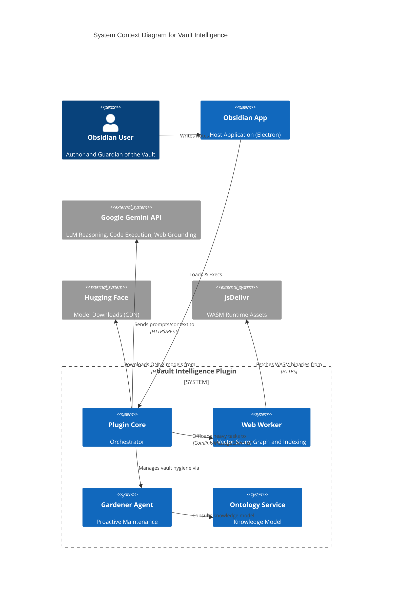
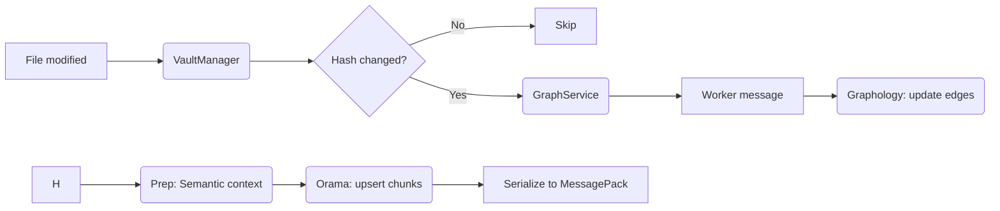
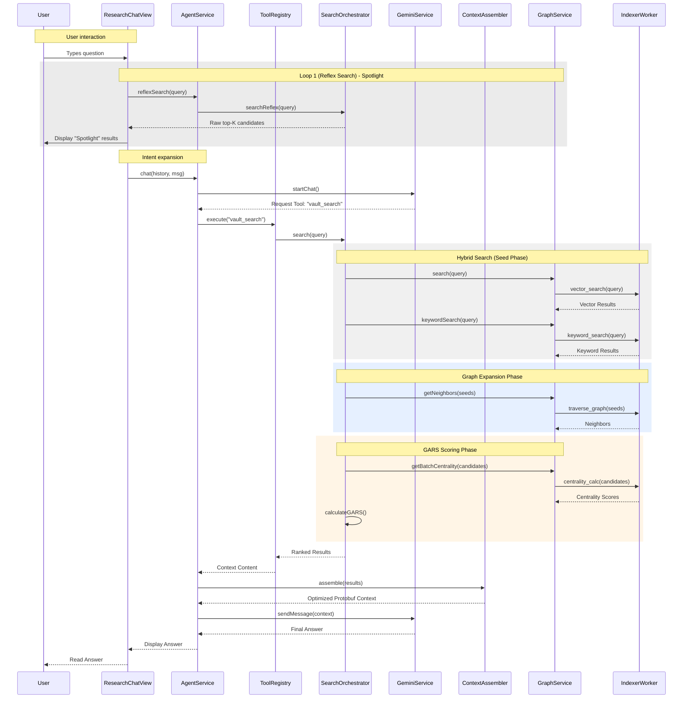
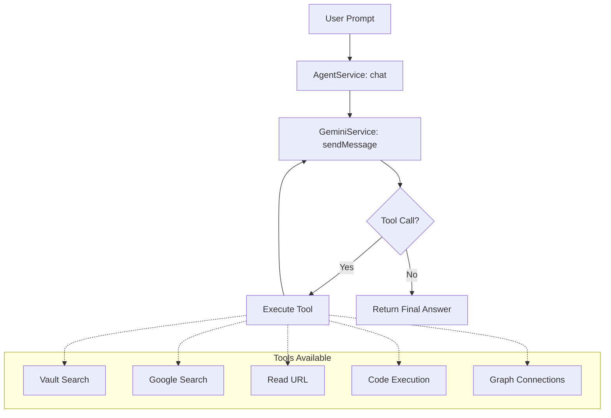
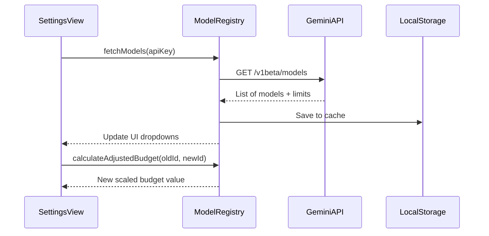
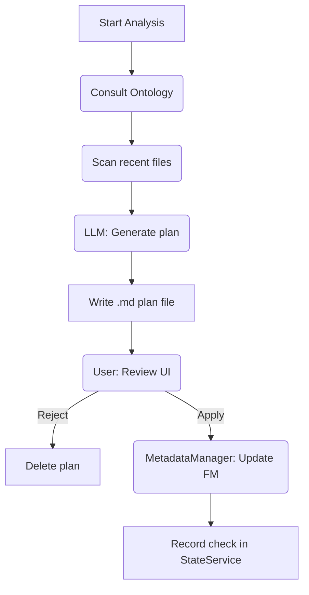
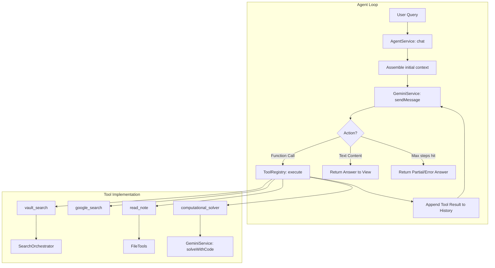

# System architecture

**Version**: 4.3.1
**Status**: Active
**Audience**: Developers, Systems Architects, Maintainers

---

## 1. High-level system overview

Vault Intelligence is an Obsidian plugin that transforms a static markdown vault into an active knowledge base using local and cloud-based AI. It is designed as a _Hybrid System_ that bridges local privacy (Web Workers, Orama) with cloud capability (Gemini).

### System context diagram (C4 level 1)



### Core responsibilities

-   Indexing and retrieval: Converting markdown notes into vector embeddings and maintaining a searchable index.
-   Semantic search: Finding relevant notes based on meaning, not just keywords.
-   Agentic reasoning: An AI agent that uses tools (Search, Code, Read) to answer user questions using vault data. Supports multilingual system prompts.
-   Vault hygiene (Gardener): A specialised agent that proposes metadata and structural improvements to the vault based on a shared ontology.
-   Knowledge graph: Maintaining a formal graph structure of note connections (wikilinks) and metadata.
-   Ontology management: Defining and enforcing a consistent vocabulary (concepts, entities) across the vault.

---

## 2. Core architecture and design patterns

### Architectural pattern

The system follows a _Service-Oriented Architecture (SOA)_ adapted for a monolithic client-side application.

-   **Services** (eg `GraphService`, `GeminiService`) encapsulate business logic and are instantiated as singletons in `main.ts`.
-   **Strategy pattern** is used for the embedding layer (`RoutingEmbeddingService` switches between `Local` and `Gemini`).
-   **Facade pattern**: `GraphService` acts as a facade over the complex `WebWorker` <-> `MainThread` communication. It provides high-level methods like `getGraphEnhancedSimilar` for views.
-   **Delegation pattern**: `AgentService` delegates search and context assembly to `SearchOrchestrator` and `ContextAssembler`. It exposes `reflexSearch` for fast-path UI feedback.
-   **Plan-review-apply pattern**: Used by the `GardenerService` to ensure user oversight for vault modifications.
-   **Safe Mutation**: `MetadataManager` centralises all vault frontmatter updates, ensuring thread safety and idempotency.

### Brain vs Body

-   **The body (views)**: React is NOT used. Views (`ResearchChatView.ts`) are built using native DOM manipulation or simple rendering helpers to keep the bundle size small and performance high. State is local to the view.
-   **The brain (services)**: All heavy lifting happens in services. Views never touch `app.vault` directly; they ask dedicated managers like `VaultManager` or `MetadataManager` to perform operations.

### Dependency injection

Manual Dependency Injection is used in `main.ts`. Services are instantiated in a specific order and passed via constructor injection to dependent services.

```typescript
// main.ts
this.geminiService = new GeminiService(settings);
this.embeddingService = new RoutingEmbeddingService(..., geminiService); // Injects dependency
this.graphService = new GraphService(..., embeddingService); // Injects dependency
```

---

## 3. Detailed Data Flow

### 3.1. The "Vectorization" pipeline (indexing)

#### Indexing pipeline architecture

1.  **Intent**: Converts raw markdown edits into searchable vector embeddings and graph relationships.
2.  **Trigger mechanism**: `Event: vault.on('modify')` (Debounced).
3.  **The "black box" contract**:
    -   **Input**: `TFile`
    -   **Output**: `OramaDocument` + `GraphNode`
4.  **Mechanics**:



1.  **Processing details**:

-   **Excalidraw sanitization**: The worker automatically detects and strips `compressed-json` blocks from drawings, preserving only the actual text labels to prevent high-entropy JSON metadata from "poisoning" the vector space.
-   **Semantic context injection**: The system pre-pends a standard header (Title, Topics, Tags, Author) to every document chunk. This creates "semantic bridges" that allow the index to associate concepts even without explicit Wikilinks.
-   **Serial Queue**: `GraphService` implements a serial `processingQueue` to handle rate limiting and prevent worker overload.

### 3.1.1 Graph Link Resolution (Systemic Path Resolution)

To support Obsidian's flexible `[[Basename]]` linking without creating "Ghost Nodes", the `GraphService` maintains a global alias map.

1.  **Synchronization**: `GraphService.syncAliases()` iterates all vault files and maps `basename.toLowerCase() -> fullPath`.
2.  **Worker Update**: This map is pushed to the `IndexerWorker`.
3.  **Resolution**: During indexing, `resolvePath` uses this map to canonicalize all links (eg `[[Agentic AI]]` -> `Ontology/Concepts/Agentic AI.md`).

### 3.2. Search and answer loop (data flow)

#### The RAG cycle

1.  **Intent**: User asks a question in the chat.
2.  **Mechanics**:



1.  **Tool calling loop (control flow)**:

The `AgentService` uses a loop to handle multiple tool calls (up to `maxAgentSteps`) before providing a final answer.



### 3.3. Context assembly (relative accordion)

To maximise the utility of the context window while staying within token budgets, the `ContextAssembler` employs **Relative Accordion Logic** to dynamically scale document density based on the gap between the top match and secondary results:

| Relevance Tier | Threshold | Strategy |
| :--- | :--- | :--- |
| **Primary** | >= 90% of top | Full file content (subject to 10% soft limit cap). |
| **Supporting** | >= 70% of top | Contextual snippets extracted around search terms. |
| **Structural** | >= 35% of top | Note structure (headers) only. Capped at top 10 files. |
| **Filtered** | < 35% of top | Skipped entirely to reduce prompt noise. |

#### Hybrid score calibration

To ensure keyword matches do not overwhelm semantic similarity, the `SearchOrchestrator` applies a **Sigmoid Calibration** to BM25 scores before blending.

The formula used is:
`normalizedScore = score / (score + keywordWeight)`

Where `keywordWeight` (default `1.2`) is a configurable parameter in the plugin settings. This ensures that while keyword scores are unbounded, the normalized result always approaches `1.0` asymptotically, preserving ranking granularity without breaking the 0-100% scale.

This "Relative Ranking" approach ensures that even in large vaults, the agent only receives high-confidence information, preventing "hallucination by bloat".

### 3.4. Dynamic model ranking and fetching

The `ModelRegistry` synchronises available Gemini models and ranks them to ensure the user always has access to the most capable stable versions.

1.  **Fetch**: Models are fetched from the Google AI API and cached locally.
2.  **Scoring**: A weighted scoring system (`ModelRegistry.sortModels`) ranks models based on:
    -   **Tier**: Gemini 3 > Gemini 2.5 > Gemini 2 > Gemini 1.5.
    -   **Capability**: Pro > Flash > Lite.
    -   **Stability**: Preview or Experimental versions receive a penalty.
3.  **Budget Scaling**: When switching models, `calculateAdjustedBudget` ensures the user's context configuration scales proportionally (eg if a user sets a 10% budget on a 1M model, it scales to 10% on a 32k model).

### 3.5. Model fetching and budget scaling (metadata flow)

#### Dynamic model reconfiguration

1.  **Intent**: Synchronize available Gemini models and ensure context budgets are scaled proportionally to model limits.
2.  **Mechanics**:



1.  Models are ranked based on their capabilities (Flash vs Pro) and version (Gemini 3 > 2 > 1.5). Preview and experimental models receive a penalty in ranking to prefer stable releases for the main user interface.

### 3.6. System mechanics and orchestration

-   **Pipeline registry**:
 There is no central registry. Pipelines are implicit in the event listeners registered by `GraphService` in `registerEvents()`.
-   **Extension points**: Currently closed. New pipelines require modifying `GraphService`.
-   **The event bus**:
    The plugin relies on Obsidian's global `app.metadataCache` and `app.vault` events.
    -   `UI Events`: Handled by Views.
    -   `System Events`: Handled by `VaultManager`.

### 3.7. The "Gardening" cycle (vault hygiene)

#### Gardener plan-act cycle

1.  **Intent**: Systematic improvement of vault metadata and structure.
2.  **Trigger mechanism**: Manual command or periodic background scan.
3.  **The "black box" contract**:

-   **Input**: Vault subset + Ontology context.
-   **Output**: Interactive Gardener Plan (JSON-in-Markdown).

1.  **Stages**:



---

## 4. Control flow and interfaces

### 4.1. Core Service Relationships

```mermaid
classDiagram
    class AgentService {
        +chat(history, msg)
        +prepareContext(msg)
    }
    class ToolRegistry {
        +getTools()
        +execute(tool)
    }
    class SearchOrchestrator {
        +search(query)
    }
    class ContextAssembler {
        +assemble(results)
    }
    class GraphService {
        +initialize()
        +search()
    }
    class IndexerWorker {
        +search(vector)
        +updateFile()
    }
    class GeminiService {
        +startChat()
        +generateContent()
    }

    AgentService --> ToolRegistry : executes tools
    AgentService --> SearchOrchestrator : delegates search
    AgentService --> ContextAssembler : delegates RAG
    AgentService --> GeminiService : calls generic LLM
    ToolRegistry --> GraphService : uses for graph tools
    ToolRegistry --> SearchOrchestrator : uses for search tool
    TR_VAULT_SEARCH[Tool: vault_search] -.-> SearchOrchestrator : calls
    TR_READ_NOTE[Tool: read_note] -.-> FileTools : calls
    SearchOrchestrator --> GraphService : uses index
    GraphService ..> IndexerWorker : via Comlink
```

### 4.2. Tool Execution Control Flow

The `AgentService` manages a deliberative loop where it consults the LLM, executes proposed tool calls, and feeds the results back into the conversation context until a final answer is reached or the step limit is hit.



### Service interface documentation

#### `IEmbeddingService`

The contract for any provider that can turn text into numbers.

```typescript
export type EmbeddingPriority = 'high' | 'low';

export interface IEmbeddingService {
    readonly modelName: string;
    readonly dimensions: number;

    embedQuery(text: string, priority?: EmbeddingPriority): Promise<number[]>;
    embedDocument(text: string, title?: string, priority?: EmbeddingPriority): Promise<number[][]>;
    updateConfiguration?(): void;
}
```

#### `WorkerAPI` (Comlink interface)

The contract exposed by the Web Worker to the main thread.

```typescript
export interface WorkerAPI {
    initialize(config: WorkerConfig, fetcher?: unknown, embedder?: (text: string, title: string) => Promise<number[]>): Promise<void>;
    updateFile(path: string, content: string, mtime: number, size: number, title: string): Promise<void>;
    getFileStates(): Promise<Record<string, { mtime: number, hash: string }>>;
    deleteFile(path: string): Promise<void>;
    renameFile(oldPath: string, newPath: string): Promise<void>;
    search(query: string, limit?: number): Promise<GraphSearchResult[]>;
    keywordSearch(query: string, limit?: number): Promise<GraphSearchResult[]>;
    searchInPaths(query: string, paths: string[], limit?: number): Promise<GraphSearchResult[]>;
    getSimilar(path: string, limit?: number): Promise<GraphSearchResult[]>;
    getNeighbors(path: string, options?: { direction?: 'both' | 'inbound' | 'outbound'; mode?: 'simple' | 'ontology'; decay?: number }): Promise<GraphSearchResult[]>;
    getCentrality(path: string): Promise<number>;
    getBatchCentrality(paths: string[]): Promise<Record<string, number>>;
    getBatchMetadata(paths: string[]): Promise<Record<string, { title?: string, headers?: string[] }>>;
    updateAliasMap(map: Record<string, string>): Promise<void>;
    saveIndex(): Promise<Uint8Array>;
    loadIndex(data: string | Uint8Array): Promise<void>;
    updateConfig(config: Partial<WorkerConfig>): Promise<void>;
    clearIndex(): Promise<void>;
    fullReset(): Promise<void>;
}
```

#### `IOntologyService` (Internal)

Manages the knowledge model and classification rules.

```typescript
export interface IOntologyService {
    getValidTopics(): Promise<{ name: string, path: string }[]>;
    getOntologyContext(): Promise<{ folders: Record<string, string>, instructions?: string }>;
    validateTopic(topicPath: string): boolean;
}
```

#### `IModelRegistry` (Static Interface)

Registers and sorts available AI models.

```typescript
export interface ModelDefinition {
    id: string;
    label: string;
    provider: 'gemini' | 'local';
    inputTokenLimit?: number;
    outputTokenLimit?: number;
}

export class ModelRegistry {
    public static fetchModels(app: App, apiKey: string, cacheDurationDays?: number): Promise<void>;
    public static getChatModels(): ModelDefinition[];
    public static getEmbeddingModels(provider?: 'gemini' | 'local'): ModelDefinition[];
    public static getGroundingModels(): ModelDefinition[];
    public static calculateAdjustedBudget(current: number, oldId: string, newId: string): number;
}
```

#### `GraphService` (Facade)

Manages the semantic graph and vector index worker.

```typescript
export class GraphService {
    public initialize(): Promise<void>;
    public search(query: string, limit?: number): Promise<GraphSearchResult[]>;
    public keywordSearch(query: string, limit?: number): Promise<GraphSearchResult[]>;
    public getSimilar(path: string, limit?: number): Promise<GraphSearchResult[]>;
    public getNeighbors(path: string, options?: any): Promise<GraphSearchResult[]>;
    public scanAll(forceWipe?: boolean): Promise<void>;
    public forceSave(): Promise<void>;
}
```

#### `SearchOrchestrator`

Orchestrates hybrid search strategies.

```typescript
export class SearchOrchestrator {
    public search(query: string, limit: number): Promise<VaultSearchResult[]>;
}
```

---

## 5. Magic and configuration

### Constants reference (`src/constants.ts`)

| Constant | Value | Description |
| :--- | :--- | :--- |
| `WORKER_INDEXER_CONSTANTS.SEARCH_LIMIT_DEFAULT` | `5` | Default number of results for vector search. |
| `WORKER_INDEXER_CONSTANTS.SIMILARITY_THRESHOLD_STRICT` | `0.001` | Minimum cosine similarity to consider a note "related". |
| `WORKER_INDEXER_CONSTANTS.KEYWORD_TOLERANCE` | `2` | Levenshtein distance allowed for fuzzy keyword matching. |
| `WORKER_INDEXER_CONSTANTS.RECALL_THRESHOLD_PERMISSIVE` | `1.0` | Orama threshold setting for maximum recall (Permissive/OR logic). |
| `SEARCH_CONSTANTS.CHARS_PER_TOKEN_ESTIMATE` | `4` | Heuristic for budget calculation (English). |
| `SEARCH_CONSTANTS.SINGLE_DOC_SOFT_LIMIT_RATIO` | `0.10` | Prevent any single doc from starving others in context assembly. |
| `GARDENER_CONSTANTS.PLAN_PREFIX` | `"Gardener Plan"` | Prefix for generated hygiene plans. |
| `WORKER_CONSTANTS.CIRCUIT_BREAKER_RESET_MS` | `300000` | (5 mins) Time before retrying a crashed worker. |

### Anti-pattern watchlist

1.  **Direct `app.vault` access in views**: NEVER access the vault directly in a View for write operations. Use `VaultManager` or `MetadataManager`.
2.  **Blocking the main thread**: NEVER perform synchronous heavy math or huge JSON parsing on the main thread. Use the indexer worker.
3.  **Local state in services**: Services should remain stateless where possible, deferring state to `settings` or the `GardenerStateService`.

---

### 6. External integrations

### LLM provider abstraction

Currently, the system is tighter coupled to **Google Gemini** (`GeminiService`), but abstraction covers the Embeddings layer.

-   **Strategy**: `GeminiService` handles all Chat/Reasoning. `IEmbeddingService` handles Vectors.

### Failover and retry logic

-   **Gemini API**: The `GeminiService` implements an exponential backoff retry mechanism for `429 Too Many Requests` errors (default 3 retries).
-   **Local worker**: Implements a "Progressive Stability Degradation" (ADR-003). If the worker crashes, it restarts with simpler settings (threads -> 1, SIMD -> off).

---

## 7. Developer onboarding guide

### Build pipeline

-   **Tool**: `esbuild`.
-   **Config**: `esbuild.config.mjs`.
-   **Worker bundling**: The worker source (`src/workers/*.ts`) is inlined into base64 strings and injected into `main.js` using `esbuild-plugin-inline-worker`. This allows the plugin to remain a single file distributable.

### Testing strategy

-   Unit tests: Not fully established.
-   Manual testing:
    -   Use the "Debug Sidebar" (in Dev settings) to inspect the Worker state.
    -   Use `npm run dev` to watch for changes and hot-reload.
