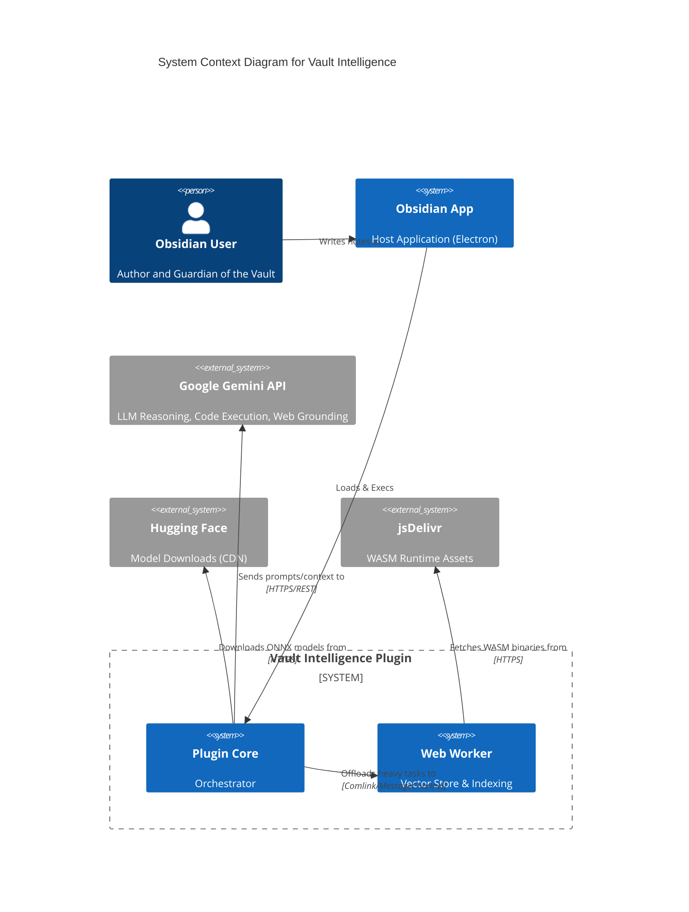

# System Architecture

**Version**: 1.0.0
**Status**: Active
**Audience**: Developers, Systems Architects, Maintainers

---

## 1. High-Level System Overview

Vault Intelligence is an Obsidian plugin that transforms a static markdown vault into an active knowledge base using local and cloud-based AI. It is designed as a **Hybrid System** that bridges local privacy (Web Workers, Orama) with cloud capability (Gemini).

### System Context Diagram (C4 Level 1)



### Core Responsibilities
*   **Indexing & Retrieval**: Converting markdown notes into vector embeddings and maintaining a searchable index.
*   **Semantic Search**: Finding relevant notes based on meaning, not just keywords.
*   **Agentic Reasoning**: An AI agent that uses "Tools" (Search, Code, Read) to answer user questions using vault data.
*   **Knowledge Graph**: Maintaining a lightweight graph structure of note connections (wikilinks).

---

## 2. Core Architecture & Design Patterns

### Architectural Pattern
The system follows a **Service-Oriented Architecture (SOA)** adapted for a monolithic client-side application.
*   **Services** (e.g., `GraphService`, `GeminiService`) encapsulate business logic and are instantiated as multiple singletons in `main.ts`.
*   **Strategy Pattern** is used heavily for the Embedding Layer (`RoutingEmbeddingService` switches between `Local` and `Gemini`).
*   **Facade Pattern**: `GraphService` acts as a facade over the complex `WebWorker` <-> `MainThread` communication.

### The "Brain" vs. The "Body"
*   **The Body (Views)**: React is NOT used. Views (`ResearchChatView.ts`) are built using native DOM manipulation or simple rendering helpers to keep the bundle size small and performance high. State is local to the View.
*   **The Brain (Services)**: All heavy lifting happens in Services. Views never touch `app.vault` directly if possible; they ask `GraphService` or `GeminiService` to do work.

### Dependency Injection
Manual Dependency Injection is used in `main.ts`. Services are instantiated in a specific order and passed via constructor injection to dependent services.

```typescript
// main.ts
this.geminiService = new GeminiService(settings);
this.embeddingService = new RoutingEmbeddingService(..., geminiService); // Injects dependency
this.graphService = new GraphService(..., embeddingService); // Injects dependency
```

---

## 3. Detailed Data Flow

### 3.1. The "Vectorization" Pipeline (Indexing)

> **### Indexing Pipeline Architecture Template**
>
> 1. **Intent**: Converts raw markdown edits into searchable vector embeddings stored in the Worker.
> 2. **Trigger Mechanism**: `Event: vault.on('modify')` (Debounced).
> 3. **The "Black Box" Contract**:
>    - **Input**: `TFile` (Obsidian Layout)
>    - **Output**: `OramaDocument` (Internal Worker State)
> 4. **Stages**:
>    ```mermaid
>    flowchart LR
>      A[File Modified] --> B(VaultManagerRead)
>      B --> C{Hash Changed?}
>      C -- No --> D[Skip]
>      C -- Yes --> E(GraphService)
>      E --> F[Worker Message]
>      F --> G(Tokenizer/Chunker)
>      G --> H(EmbeddingService)
>      H --> I[Orama Insert]
>    ```
> 5. **Failure Strategy**: Silent Fail with Logging. No retry queue to prevent infinite loops on bad files.

### 3.2. System Mechanics & Orchestration

*   **Pipeline Registry**: There is no central registry. Pipelines are implicit in the event listeners registered by `GraphService` in `registerEvents()`.
*   **Extension Points**: Currently closed. New pipelines require modifying `GraphService`.

*   **The Event Bus**:
    The plugin relies on Obsidian's global `app.metadataCache` and `app.vault` events.
    *   `UI Events`: Handled by Views.
    *   `System Events`: Handled by `VaultManager`.

### 3.3. Abstract Data Models

*   **Unit of Work**: The `GraphNodeData` interface wraps file metadata.
*   **Persistence Patterns**:
    *   **Repository Pattern**: `GraphService` acts as the repository.
    *   **Storage**: The index is serialized to JSON (`data/graph-state.json`) and stored in the user's vault adapter. It is NOT stored in IndexedDB (to keep it file-backed and sync-friendly).

---

## 4. Control Flow & Interfaces

### Service Interface Documentation

#### `IEmbeddingService`
The contract for any provider that can turn text into numbers.

```typescript
export type EmbeddingPriority = 'high' | 'low';

export interface IEmbeddingService {
    readonly modelName: string;
    readonly dimensions: number;

    embedQuery(text: string, priority?: EmbeddingPriority): Promise<number[]>;
    embedDocument(text: string, title?: string, priority?: EmbeddingPriority): Promise<number[][]>;

    /**
     * Update configuration on the fly (e.g. thread count).
     * This allows the service to adapt to changed settings without a full restart.
     */
    updateConfiguration?(): void;
}
```

#### `WorkerAPI` (Comlink Interface)
The contract exposed by the Web Worker to the Main Thread.

```typescript
export interface WorkerAPI {
    initialize(config: WorkerConfig, fetcher?: unknown, embedder?: unknown): Promise<void>;
    updateFile(path: string, content: string, mtime: number, size: number, title: string): Promise<void>;
    deleteFile(path: string): Promise<void>;
    renameFile(oldPath: string, newPath: string): Promise<void>;
    search(query: string, limit: number): Promise<GraphSearchResult[]>;
    getSimilar(path: string, limit: number): Promise<GraphSearchResult[]>;
    saveIndex(): Promise<string>;
    loadIndex(data: string): Promise<void>;
    updateConfig(config: Partial<WorkerConfig>): Promise<void>;
    fullReset(): Promise<void>;
}
```

---

## 5. "Magic" & Configuration

### Constants Reference (`src/constants.ts`)

| Constant | Value | Description |
| :--- | :--- | :--- |
| `WORKER_INDEXER_CONSTANTS.SEARCH_LIMIT_DEFAULT` | `10` | Default number of results for vector search. |
| `WORKER_INDEXER_CONSTANTS.SIMILARITY_THRESHOLD_STRICT` | `0.5` | Minimum cosine similarity to consider a note "related". |
| `SEARCH_CONSTANTS.CHARS_PER_TOKEN_ESTIMATE` | `4` | Heuristic for budget calculation (English). |
| `WORKER_CONSTANTS.CIRCUIT_BREAKER_RESET_MS` | `300000` | (5 mins) Time before retrying a crashed worker. |

### Anti-Pattern Watchlist

1.  **Direct `app.vault` Access in Views**: NEVER access the vault directly in a View for write operations. Use `VaultManager`.
2.  **Blocking the Main Thread**: NEVER perform synchronous heavy math or huge JSON parsing on the main thread. Use the Worker.
3.  **Local State in Services**: Services should remain stateless where possible, deferring state to `settings` or the `Worker`.

---

## 6. External Integrations

### LLM Provider Abstraction
Currently, the system is tighter coupled to **Google Gemini** (`GeminiService`), but abstraction covers the Embeddings layer.
*   **Strategy**: `GeminiService` handles all Chat/Reasoning. `IEmbeddingService` handles Vectors.

### Failover & Retry Logic
*   **Gemini API**: The `GeminiService` implements an exponential backoff retry mechanism for `429 Too Many Requests` errors (default 3 retries).
*   **Local Worker**: Implements a "Progressive Stability Degradation" (ADR-003). If the worker crashes, it restarts with simpler settings (Threads -> 1, SIMD -> Off).

---

## 7. Developer Onboarding Guide

### Build Pipeline
*   **Tool**: `esbuild`.
*   **Config**: `esbuild.config.mjs`.
*   **Worker Bundling**: The worker source (`src/workers/*.ts`) is inlined into base64 strings and injected into `main.js` using `esbuild-plugin-inline-worker`. This allows the plugin to remain a single file distributable.

### Testing Strategy
*   **Unit Tests**: Not fully established.
*   **Manual Testing**:
    *   Use the "Debug Sidebar" (in Dev settings) to inspect the Worker state.
    *   Use `npm run dev` to watch for changes and hot-reload.
