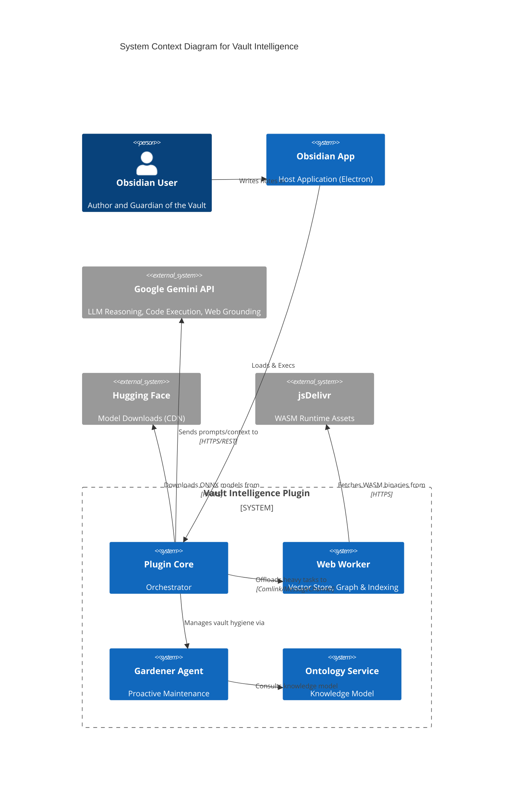

# System Architecture

**Version**: 1.0.0
**Status**: Active
**Audience**: Developers, Systems Architects, Maintainers

---

## 1. High-level system overview

Vault Intelligence is an Obsidian plugin that transforms a static markdown vault into an active knowledge base using local and cloud-based AI. It is designed as a **Hybrid System** that bridges local privacy (Web Workers, Orama) with cloud capability (Gemini).

### System context diagram (C4 level 1)



### Core responsibilities

* **Indexing and retrieval**: Converting markdown notes into vector embeddings and maintaining a searchable index.
* **Semantic search**: Finding relevant notes based on meaning, not just keywords.
* **Agentic reasoning**: An AI agent that uses "tools" (Search, Code, Read) to answer user questions using vault data.
* **Vault hygiene (Gardener)**: A specialized agent that proposes metadata and structural improvements to the vault based on a shared ontology.
* **Knowledge graph**: Maintaining a formal graph structure of note connections (wikilinks) and metadata.
* **Ontology management**: Defining and enforcing a consistent vocabulary (concepts, entities) across the vault.

---

## 2. Core architecture and design patterns

### Architectural pattern

The system follows a **Service-Oriented Architecture (SOA)** adapted for a monolithic client-side application.

* **Services** (e.g., `GraphService`, `GeminiService`) encapsulate business logic and are instantiated as singletons in `main.ts`.
* **Strategy pattern** is used for the embedding layer (`RoutingEmbeddingService` switches between `Local` and `Gemini`).
* **Facade pattern**: `GraphService` acts as a facade over the complex `WebWorker` <-> `MainThread` communication.
* **Delegation pattern**: `AgentService` delegates search and context assembly to `SearchOrchestrator` and `ContextAssembler`.
* **Plan-review-apply pattern**: Used by the `GardenerService` to ensure user oversight for vault modifications.

### Brain vs. Body

* **The body (Views)**: React is NOT used. Views (`ResearchChatView.ts`) are built using native DOM manipulation or simple rendering helpers to keep the bundle size small and performance high. State is local to the View.
* **The brain (Services)**: All heavy lifting happens in Services. Views never touch `app.vault` directly; they ask dedicated managers like `VaultManager` or `MetadataManager` to perform operations.

### Dependency Injection
Manual Dependency Injection is used in `main.ts`. Services are instantiated in a specific order and passed via constructor injection to dependent services.

```typescript
// main.ts
this.geminiService = new GeminiService(settings);
this.embeddingService = new RoutingEmbeddingService(..., geminiService); // Injects dependency
this.graphService = new GraphService(..., embeddingService); // Injects dependency
```

---

## 3. Detailed Data Flow

### 3.1. The "Vectorization" pipeline (indexing)

> #### Indexing pipeline architecture
>
> 1. **Intent**: Converts raw markdown edits into searchable vector embeddings and graph relationships.
> 2. **Trigger mechanism**: `Event: vault.on('modify')` (Debounced).
> 3. **The "black box" contract**:
>    - **Input**: `TFile`
>    - **Output**: `OramaDocument` + `GraphNode`
> 4. **Stages**:
>    ```mermaid
>    flowchart LR
>      A[File modified] --> B(VaultManager)
>      B --> C{Hash changed?}
>      C -- No --> D[Skip]
>      C -- Yes --> E(GraphService)
>      E --> F[Worker message]
>      F --> G(Graphology: update edges)
>      F --> H(Orama: upsert vector)
>      H --> I[Serialize to disk]
>    ```
> 5. **Failure strategy**: Silent fail with logging. No retry queue to prevent infinite loops.

### 3.2. System Mechanics & Orchestration

*   **Pipeline Registry**: There is no central registry. Pipelines are implicit in the event listeners registered by `GraphService` in `registerEvents()`.
*   **Extension Points**: Currently closed. New pipelines require modifying `GraphService`.

*   **The Event Bus**:
    The plugin relies on Obsidian's global `app.metadataCache` and `app.vault` events.
    *   `UI Events`: Handled by Views.
    *   `System Events`: Handled by `VaultManager`.

### 3.3. Abstract data models

* **Unit of work**: The `GraphNodeData` interface wraps file metadata and relationship state.
* **Persistence patterns**:
    * **Repository pattern**: `GraphService` acts as the repository.
    * **Storage**: The state is serialized to JSON (`data/graph-state.json`) in the vault.

### 3.4. The "Gardening" cycle (vault hygiene)

> #### Gardener plan-act cycle
>
> 1. **Intent**: Systematic improvement of vault metadata and structure.
> 2. **Trigger mechanism**: Manual command or periodic background scan.
> 3. **The "black box" contract**:
>    - **Input**: Vault subset + Ontology context.
>    - **Output**: Interactive Gardener Plan (JSON-in-Markdown).
> 4. **Stages**:
>    ```mermaid
>    flowchart TD
>      A[Start Analysis] --> B(Consult Ontology)
>      B --> C(Scan recent files)
>      C --> D(LLM: Generate plan)
>      D --> E[Write .md plan file]
>      E --> F(User: Review UI)
>      F -- Reject --> G[Delete plan]
>      F -- Apply --> H(MetadataManager: Update FM)
>      H --> I[Record check in StateService]
>    ```

---

## 4. Control flow and interfaces

### Service interface documentation

#### `IEmbeddingService`

The contract for any provider that can turn text into numbers.

```typescript
export type EmbeddingPriority = 'high' | 'low';

export interface IEmbeddingService {
    readonly modelName: string;
    readonly dimensions: number;

    embedQuery(text: string, priority?: EmbeddingPriority): Promise<number[]>;
    embedDocument(text: string, title?: string, priority?: EmbeddingPriority): Promise<number[][]>;
    updateConfiguration?(): void;
}
```

#### `WorkerAPI` (Comlink interface)

The contract exposed by the Web Worker to the main thread.

```typescript
export interface WorkerAPI {
    initialize(config: WorkerConfig, fetcher?: unknown, embedder?: unknown): Promise<void>;
    updateFile(path: string, content: string, mtime: number, size: number, title: string): Promise<void>;
    deleteFile(path: string): Promise<void>;
    renameFile(oldPath: string, newPath: string): Promise<void>;
    search(query: string, limit: number): Promise<GraphSearchResult[]>;
    getSimilar(path: string, limit: number): Promise<GraphSearchResult[]>;
    saveIndex(): Promise<string>;
    loadIndex(data: string): Promise<void>;
    updateConfig(config: Partial<WorkerConfig>): Promise<void>;
    fullReset(): Promise<void>;
}
```

#### `IOntologyService` (Internal)

Manages the knowledge model and classification rules.

```typescript
export interface IOntologyService {
    getValidTopics(): Promise<{ name: string, path: string }[]>;
    getOntologyContext(): Promise<{ folders: Record<string, string>, instructions?: string }>;
    validateTopic(topicPath: string): boolean;
}
```

---

## 5. Magic and configuration

### Constants reference (`src/constants.ts`)

| Constant | Value | Description |
| :--- | :--- | :--- |
| `WORKER_INDEXER_CONSTANTS.SEARCH_LIMIT_DEFAULT` | `5` | Default number of results for vector search. |
| `WORKER_INDEXER_CONSTANTS.SIMILARITY_THRESHOLD_STRICT` | `0.001` | Minimum cosine similarity to consider a note "related". |
| `SEARCH_CONSTANTS.CHARS_PER_TOKEN_ESTIMATE` | `4` | Heuristic for budget calculation (English). |
| `SEARCH_CONSTANTS.SINGLE_DOC_SOFT_LIMIT_RATIO` | `0.25` | Prevent any single doc from starving others in context assembly. |
| `GARDENER_CONSTANTS.PLAN_PREFIX` | `"Gardener Plan"` | Prefix for generated hygiene plans. |
| `WORKER_CONSTANTS.CIRCUIT_BREAKER_RESET_MS` | `300000` | (5 mins) Time before retrying a crashed worker. |

### Anti-pattern watchlist

1. **Direct `app.vault` access in views**: NEVER access the vault directly in a View for write operations. Use `VaultManager` or `MetadataManager`.
2. **Blocking the main thread**: NEVER perform synchronous heavy math or huge JSON parsing on the main thread. Use the indexer worker.
3. **Local state in services**: Services should remain stateless where possible, deferring state to `settings` or the `GardenerStateService`.

---

## 6. External Integrations

### LLM Provider Abstraction
Currently, the system is tighter coupled to **Google Gemini** (`GeminiService`), but abstraction covers the Embeddings layer.
*   **Strategy**: `GeminiService` handles all Chat/Reasoning. `IEmbeddingService` handles Vectors.

### Failover & Retry Logic
*   **Gemini API**: The `GeminiService` implements an exponential backoff retry mechanism for `429 Too Many Requests` errors (default 3 retries).
*   **Local Worker**: Implements a "Progressive Stability Degradation" (ADR-003). If the worker crashes, it restarts with simpler settings (Threads -> 1, SIMD -> Off).

---

## 7. Developer Onboarding Guide

### Build Pipeline
*   **Tool**: `esbuild`.
*   **Config**: `esbuild.config.mjs`.
*   **Worker Bundling**: The worker source (`src/workers/*.ts`) is inlined into base64 strings and injected into `main.js` using `esbuild-plugin-inline-worker`. This allows the plugin to remain a single file distributable.

### Testing Strategy
*   **Unit Tests**: Not fully established.
*   **Manual Testing**:
    *   Use the "Debug Sidebar" (in Dev settings) to inspect the Worker state.
    *   Use `npm run dev` to watch for changes and hot-reload.
