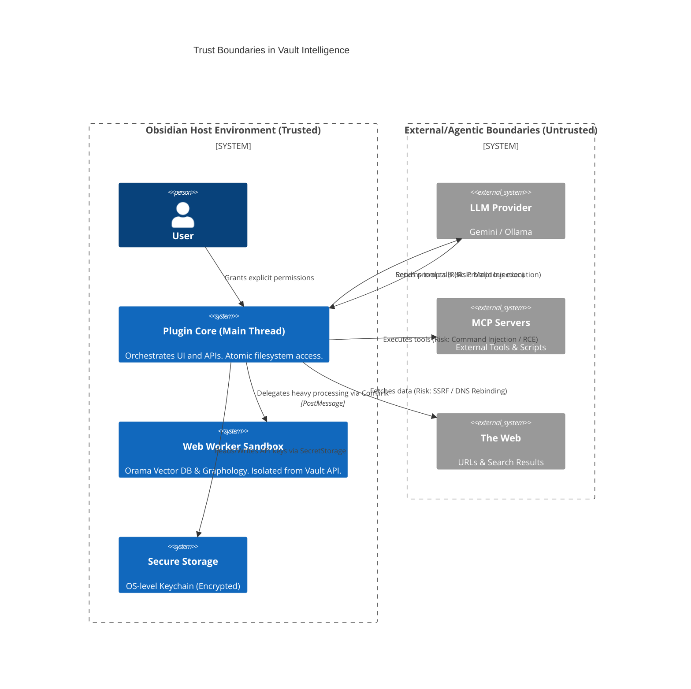
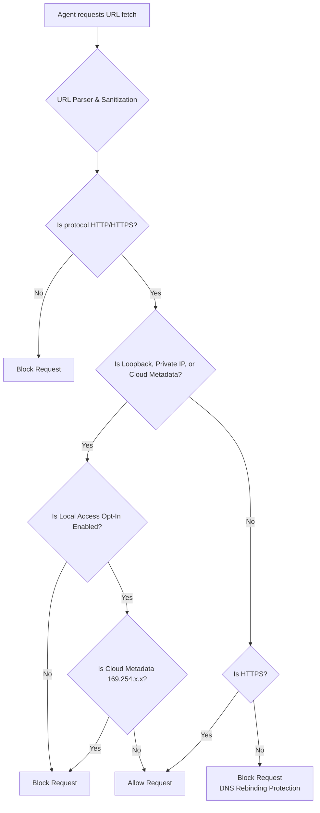

# Security and robustness in Obsidian AI plugins: Lessons from Vault Intelligence

The integration of autonomous artificial intelligence into a personal knowledge management system like Obsidian introduces a profound shift in the threat landscape. You are bridging an inherently unpredictable, prompt-injectable entity (the large language model) with a highly privileged local environment that has access to the user’s private files, local network, and operating system.

During the development of the Vault Intelligence plugin, we dedicated a massive proportion of our engineering effort to system security, isolation, and stability. We adopted a strict 'red team' mindset, assuming that the LLM acts as a 'confused deputy' that will inevitably be compromised by malicious input.

This document serves as a transparency report for our users, detailing how we protect your data. For our fellow developers, it serves as a reference architecture and an actionable checklist for building secure, enterprise-grade AI plugins in the Obsidian ecosystem.

## Core philosophy

Our security model is built upon three foundational principles:

1.  Trust but verify (Human-in-the-loop)
    Autonomous actions that mutate state or access sensitive external boundaries must always present a transparent verification step to the user.

2.  Defence in depth
    No single layer of security should be a single point of failure. We implement overlapping safeguards at the UI, network, and file-system levels.

3.  Principle of least privilege
    Agents, background web workers, and child processes are granted only the minimum permissions and environment variables strictly necessary to perform their tasks.

## Network and API security

AI plugins naturally require network access, making them prime targets for credential theft and Server-Side Request Forgery (SSRF).

### Credential management and sync isolation

A common anti-pattern in Obsidian plugins is storing API keys in plain text within the `data.json` settings file. Because users frequently sync their vaults via third-party services (eg GitHub, iCloud, Obsidian Sync), this exposes sensitive API keys to sync-related leaks.

Our approach:

-   Native OS keychains: We utilize Obsidian's native `SecretStorage` API (available in v1.11.4+), which encrypts and securely stores credentials in the operating system's native keychain.
-   Graceful degradation: For minimal Linux distributions lacking a functional keychain, we provide a resilient fallback ensuring the plugin degrades to plaintext storage gracefully (with a stark warning) rather than entering a crash loop.
-   In-memory resolution: For Model Context Protocol (MCP) servers requiring headers (eg `Authorization: Bearer <token>`), we use a `vi-secret:<key>` pointer in the JSON configuration. The plugin resolves these pointers in memory at runtime, ensuring tokens never touch the disk in plaintext.

### SSRF (Server-Side Request Forgery) prevention

If an AI agent is granted a tool to read URLs (eg to summarise web pages), an attacker could use a hidden prompt injection in a downloaded note to instruct the agent to query `http://localhost:8080/api/admin` to exfiltrate local development secrets, or query `http://169.254.169.254` to steal AWS cloud metadata credentials.

Our approach to strict URL gatekeeping:

We engineered a rigorous `isExternalUrl` utility that acts as an internal firewall for all AI-initiated network requests.

-   Default deny: We strictly block all local network IPs, private IPv4/IPv6 ranges (eg `10.x.x.x`, `192.168.x.x`), and loopback addresses (`127.0.0.1`, `[::1]`).
-   DNS rebinding protection: Attackers often bypass IP filters using DNS rebinding (where a public domain temporarily resolves to `127.0.0.1` during the request). To defeat this, we enforce HTTPS for all external requests. By forcing Chromium's TLS/SNI (Server Name Indication) handshake, a DNS rebound to `localhost` will instantly fail the certificate check, neutralizing the attack at the network layer.
-   Opt-in local access: Power users may want the AI to query local services (like a local Ollama instance). This is guarded behind an explicit allow local network access toggle. Even when enabled, cloud metadata IPs remain permanently hard-blocked.

## Agentic execution: MCP and zero-click RCE

The Model Context Protocol (MCP) allows agents to execute code, query databases, and spawn local binaries via `stdio`. This represents a massive attack surface for remote code execution (RCE). Integrating MCP required us to build rigorous execution checks to handle LLM quirks safely.

### Trust hashing

If a malicious actor alters your synced configuration files (eg changing a `python search.py` command to a malicious shell script), the plugin might silently execute it upon loading.

Our approach:

Every MCP server configuration generates a cryptographic SHA-256 fingerprint based on its command, arguments, and environment variables. If a synced `data.json` file is maliciously altered, the hash mismatches the locally approved fingerprint, and execution is instantly hard-blocked until the user manually reviews and approves the change.

### Tool name hashing and schema sanitization

Different LLM providers enforce strict constraints on tool names and JSON schema formats. Prepending server IDs to tool names to prevent collisions often exceeds length limits for APIs like Gemini.

Our approach:

-   Tool name hashing: If our composite namespace exceeds 64 characters, we digest the original tool name into an 8-character hex hash, providing a deterministic and safe short name.
-   Schema sanitization: We implemented a recursive schema function that strips unsupported keys, traverses complex objects, and provides explicit type fallbacks (eg `type: 'string'`) to guarantee that LLM APIs accept the tool definition without crashing.

### Execution boundaries and transport strategies

A compromised or poorly written MCP server might never return from a tool call, or it might stream gigabytes of garbage data.

Our approach:

We wrap every tool execution in a strict `Promise.race` containing the execution promise, a timeout promise, and user-initiated abort promises. We also separate connection logic into `Stdio`, `Sse`, and `StreamableHttp` transport strategies. This ensures that process lifecycle and timeouts are handled correctly per transport layer, without leaking zombie Node processes.

### Host environment scrubbing and command injection protection

By default, Node.js child processes inherit the parent’s `process.env`. Passing this to a third-party MCP server would leak all your local terminal secrets (eg `AWS_ACCESS_KEY_ID`). We aggressively scrub the environment, passing only a strict allowlist of necessary variables (`PATH`, `DISPLAY`, `HOME`).

We strictly utilize `child_process.spawn` with explicit argument arrays. We never use string-based shell execution (`exec`), mathematically eliminating command injection via shell metacharacters. Process tree teardowns utilize explicit PID killing (`pkill -P` / `taskkill`) to prevent zombie processes.

## Filesystem safety: The confused deputy

When granting an AI write access to the filesystem, you must assume it will eventually attempt to overwrite sensitive notes due to a hallucination or an injected prompt.

### The confused deputy CSS defence

Before any file modification occurs, we present a confirmation modal. Crucially, we display the proposed changes inside a raw `<pre><code>` block rather than using Obsidian's Markdown renderer. This prevents an attacker from utilizing injected CSS (eg `
Malicious payload
`) to hide the true destructive payload from the human reviewer.

### Path traversal and metadata sanitization

All paths generated by the LLM are stripped of leading slashes, resolved via path normalization, and checked against user-defined excluded folders. The agent cannot use relative paths to escape the vault boundaries.

We aggressively strip all YAML frontmatter from LLM-generated note bodies. Metadata updates are handled strictly programmatically to prevent the AI from corrupting Obsidian's index.

### Atomic vault operations

We abandoned the read-then-modify pattern, as it is highly vulnerable to race conditions if the Obsidian cache is stale. We exclusively use `app.vault.process()` and `app.fileManager.processFrontMatter()`. These provide atomic file locking and AST-based resolution, guaranteeing that concurrent AI writes and human edits do not obliterate one another.

## Robustness: Engineering for scale

Security is moot if the application crashes or corrupts data. Handling asynchronous file events and high-throughput vector math on a production vault requires strict architectural discipline.

### Hybrid slim-sync storage (split-brain prevention)

Vector indexes are massive binary trees. Storing a large index in the plugins folder rapidly consumes users' Obsidian Sync quotas and causes severe file conflicts.

Our approach: 

We implemented a split-brain storage architecture.

-   Hot store (IndexedDB): The full vector index, including raw text, is stored locally in the browser's IndexedDB. It is exceptionally fast and never syncs to the cloud.
-   Cold store (MessagePack): We create a 'slim' copy of the index, stripping out all raw text and retaining only the mathematical vectors and graph edges. This is serialized using MessagePack and synced across devices. Upon loading on a new device, the plugin hydrates the text on-demand from the vault to perfectly reconstruct the hot store.
-   Split-brain fix: We strictly namespace our IDB keys to prevent data collisions and corruption during concurrent background syncs.

### Event debouncing and backpressure

Typing rapidly triggers hundreds of vault modify events. Our `EventDebouncer` buffers events and batches them into optimal chunks. During critical background worker restarts, it applies a pause/resume backpressure mechanism, holding all real-time events in memory to ensure zero data loss.

### Progressive stability degradation (WASM circuit breaker)

Local WebAssembly (WASM) execution can be unstable across different hardware profiles. If the indexer worker crashes due to out-of-memory errors, the plugin catches the failure, cleans up the zombie worker, and restarts with progressively safer constraints:

1.  Multi-threaded with SIMD.
2.  Single-threaded with SIMD.
3.  Safe mode without SIMD.
4.  Circuit breaker (Halts execution to prevent battery-draining infinite crash loops).

### Resilient stream parsing

LLMs do not respect JSON schemas reliably. NDJSON streaming endpoints can break, and streaming network requests can hang. Our extraction utilities use a custom character-walking state machine that seamlessly extracts valid JSON even when the LLM hallucinates nested markdown fences, unescaped quotes, or trailing garbage.

### Self-healing indices (Rabin-Karp drift recovery)

Because our cold store strips raw text, the index only knows the byte offsets of chunks. If a user edits the top of a file, those offsets drift. When hydrating text snippets, we use a modulo-polynomial Rabin-Karp rolling hash window over the surrounding characters. This allows us to find the drifted text efficiently, perfectly self-healing the context payload before it reaches the LLM.

### Asynchronous race conditions and memory leaks

In an orchestration environment handling multiple asynchronous tasks, timeouts are essential. Improper use of `setTimeout` combined with `Promise.race` can lead to unmanaged timers holding memory references indefinitely.

We remediated hidden memory leaks throughout our process managers by explicitly clearing timeouts using `clearTimeout` in a `finally` block or upon successful promise resolution. We also enforced state cleanup routines (`wipeState`) to properly garbage collect unused orchestrator variables when a feature is toggled off.

### Regular expression denial of service

Extensive parsing of Markdown wikilinks, metadata fronts, and code blocks can run into ReDoS vulnerabilities if regular expressions are poorly structured. Backtracking on long, unclosed tags can hang the UI thread. We audited and refactored our regular expressions to eliminate deep nesting and unbounded repetition.

## The Obsidian AI plugin developer checklist

If you are developing an AI agent or RAG system for Obsidian, we highly recommend auditing your codebase against this checklist:

### Security checklist

-   [ ] Secret storage: Are you utilizing `app.secretStorage` instead of saving API keys in `data.json`? Do you have a plaintext fallback only if the OS keyring explicitly fails?
-   [ ] SSRF guards: Are you validating all URLs fetched by the agent to prevent queries to local addresses, private subnets, and cloud metadata IPs?
-   [ ] DNS rebinding: Do you force HTTPS for external fetches to leverage native TLS SNI checks against DNS rebinding?
-   [ ] Path traversal: Are you sanitizing file paths returned by the LLM and verifying they do not intersect with user-defined excluded folders?
-   [ ] The confused deputy: When showing AI-proposed changes to the user for confirmation, are you rendering them in raw `<pre><code>` blocks rather than evaluated Markdown to prevent malicious CSS obfuscation?
-   [ ] Process execution: If you spawn child processes, are you scrubbing sensitive inherited environment variables and utilizing `spawn` with argument arrays instead of `exec`?
-   [ ] Zero-click RCE: Do you cryptographically hash configurations for external tools to prevent tampering via vault syncing?

### Robustness checklist

-   [ ] Main thread integrity: Are your heavy vector embedding generation, tokenization, and graph layouts offloaded to a web worker via Comlink?
-   [ ] Atomic writes: Are you utilizing `app.vault.process()` and `app.fileManager.processFrontMatter` instead of `read()` and `modify()` to prevent frontmatter erasure during asynchronous updates?
-   [ ] Storage syncing: Are you isolating massive binary index files from Obsidian Sync to prevent quota exhaustion and merge conflicts?
-   [ ] Event thrashing and backpressure: Do you debounce vault modify events and implement a backpressure queue for when your background worker is busy or restarting?
-   [ ] Memory leaks: Do you pass an `AbortSignal` down to all network calls, and clear all your `setTimeout` IDs in `finally` blocks, especially when utilizing `Promise.race()` for timeouts?
-   [ ] Schema strictness: Do you recursively sanitize tool schemas to ensure strict LLM APIs do not reject them?
-   [ ] ReDoS checks: Have you tested your Markdown parsing regexes against maliciously crafted, deeply nested strings to avoid catastrophic backtracking?
