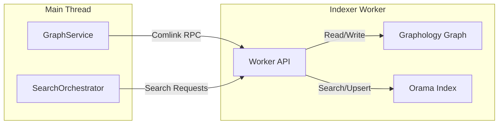
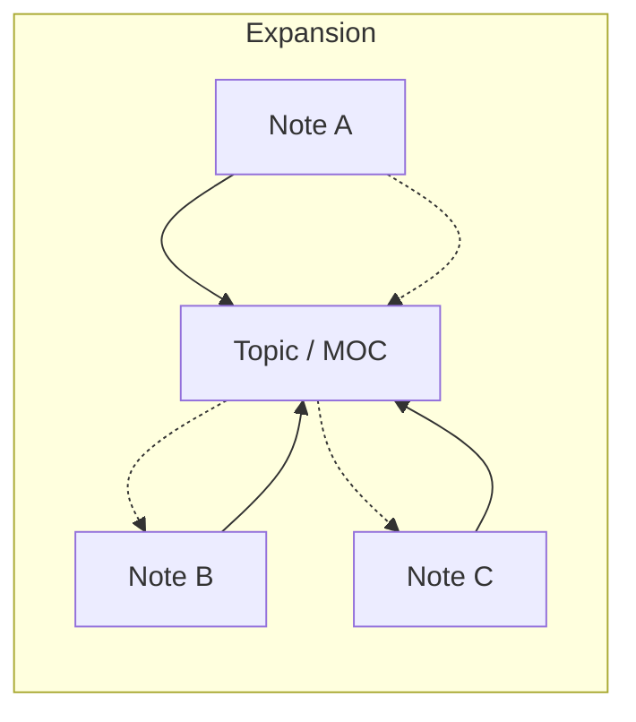

# Shadow Graph: deep technical specification

This document provides a deep dive into the architecture, implementation, and mathematical models underpinning the Shadow Graph and the Hybrid Search engine in Vault Intelligence.

## 1. Architectural overview

The Shadow Graph is a dual-engine indexing system designed to combine the strengths of vector search (semantic retrieval) with graph theory (structural relationships).

### The dual-engine core

1.  **Orama (Vector Store)**: A fast, in-memory search engine providing vector and keyword retrieval.
2.  **Graphology (Relationship Engine)**: A formal graph library for maintaining note connections, calculating centrality, and performing multi-hop traversals.

**Edge Typing**: Edges are typed (`source: 'frontmatter'` vs `source: 'body'`) to prioritize structural hierarchy over casual mentions. Frontmatter links (e.g. `topics:`) are treated as stronger signals during traversal.

### Main thread vs. worker

To prevent UI jank, all graph and vector operations happen in a **Web Worker**.

## 2. Hybrid search pipeline

The search pipeline follows a three-stage "Retrieve and Re-rank" architecture.

### Stage 1: Candidate retrieval

Initial candidates are pulled from Orama using a mixture of **Vector Search** (semantic) and **Keyword Search** (exact match). The threshold is kept low at this stage to ensure high recall.

### Stage 2: Graph analysis

For every candidate in the pool, the engine queries the Graphology instance to extract structural metrics:
- **Centrality**: Degree centrality (normalized by graph size).
- **Activation**: Neighbor analysis. Does this node connect to other nodes that also matched the query?

### Stage 3: GARS re-ranking

The final relevance score (GARS) is calculated by combining normalized component scores with user-configurable weights.

$$GARS = (sim \cdot W_{sim}) + (cent \cdot W_{cent}) + (act \cdot W_{act})$$

Where:
- $sim$: Vector similarity/relevance.
- $cent$: Node centrality (structural importance).
- $act$: Activation (connectedness to other hits).

## 3. Ontology traversal: topic siblings

A key innovation in Vault Intelligence is the **Topic Sibling** traversal. This enables discovery of related notes that are *conceptually* linked through a shared topic even if they lack direct wikilinks.

### The algorithm

1.  **1-Hop Discovery**: Find direct neighbors of the seed file.
2.  **Topic Identification**: A node is identified as a "Topic" if:
    - It resides in the configured `ontologyPath` (e.g. `Ontology/`).
    - Its in-degree exceeds `HUB_MIN_DEGREE` (default: 5).
3.  **Sibling Expansion**: For every identified Topic neighbor, look "backwards" (inbound neighbors) to find other notes linking to it.
4.  **Hub Penalty**: To avoid noise from massive hubs (e.g. Daily Notes), scores are penalized using a logarithmic decay function based on the topic's degree.

## 4. Adaptive context assembly (the accordion)

The `ContextAssembler` uses a proprietary **Accordion Strategy** to pack the maximum amount of relevant information into the LLM's context window without exceeding its limit.

### Allocation logic

Documents are ranked by GARS and assigned a "Context Mode" based on their position:

| Mode | Threshold | Content |
| :--- | :--- | :--- |
| **Full Content** | Top 1-5 hits | Entire document body is read. |
| **Snippet** | Mid-tier hits | 500-character blocks around query matches are extracted. |
| **Reference** | Bottom-tier | Only title and metadata (tags, properties) are included. |

### Sliding budget

The budget is distributed using a **Soft Limit Ratio** (default: 25% per doc). If a high-rank doc is small, the remaining space is carried over to the next document in the list, ensuring efficiency.

## 5. Persistence and state

### Serialization bridge

Because the graph and index live in the worker, state must be serialized to JSON for persistence.
- **Graphology**: Uses `graph.export()` and `graph.import()`.
- **Orama**: Uses the native `save()` and `load()` functions.

### Alias normalization
The worker maintains an internal `aliasMap` synced from the main thread to resolve wikilinks (e.g. `[[PF]]`) to their canonical paths before traversal or re-indexing.

### Incremental synchronization

The `GraphService` registers event listeners for vault changes. Only modified files are re-indexed. On rename or delete, the worker removes the stale entry from both the graph and the vector index to ensure data integrity.

---

### Implementation notes for contributors
- **Path Normalization**: Always use `workerNormalizePath` inside the worker to prevent OS-specific path issues.
- **RPC Overhead**: Use `Comlink.proxy()` for passing large data or callbacks across the bridge.
- **Memory Management**: The worker index is cleared and rebuilt only if critical config (embedding model/dimension) changes to avoid high CPU spikes.
