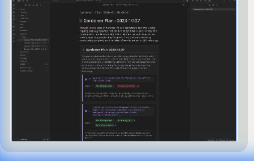

# Examples

## Knowledge retrieval

**Scenario**: I need a summary of what I know about a specific topic but can't remember where I wrote it down.

_**Query**: "What do I know about Knight Capital?"_

Ah, yes, [Vault Intelligence](https://github.com/cybaea/obsidian-vault-intelligence) found my note on Knight Capital's 2012 trading disaster and provided a concise summary.

### Contextual example

Sometimes I don't remember the right keywords to find what I'm looking for.

**Scenario**: I _know_ I wrote something about a famous bankruptcy due to software interactions and risk controls, but which one was it?

_**Query**: "What do I know about a company that went bust because of software?"_

Ah, yes, it was Knight Capital. [Vault Intelligence](https://github.com/cybaea/obsidian-vault-intelligence) found what I was looking for but also surfaced the UK Post Office scandal and three others which I had no idea I had any notes about.

The Researcher used its adaptive hybrid search to find notes that were relevant even though I did not use the exact same words. My note is on [The AI Arms Race Has a Fatal Flaw](https://www.linkedin.com/pulse/ai-arms-race-has-fatal-flaw-you-measuring-what-allan-engelhardt-7qnse) and only briefly mentions Knight Capital:

> On 1 August 2012, the financial firm Knight Capital lost $440 million in 45 minutes and was driven to bankruptcy. The cause was not one faulty algorithm. It was the unintended, destructive interaction between a _new_ trading system and a piece of _old_, supposedly defunct code. The components, safe in isolation, created a devastating feedback loop when combined. As the US Securities and Exchange Commission (SEC) later confirmed, this was a failure of systems interacting in an unforeseen way, running "without any substantial human intervention"

## Knowledge verification

**Scenario**: I am implementing Retrieval-Augmented Generation (RAG) and want to check if my understanding is up to date.

_**Query**: "What do I know about RAG and is my information comprehensive, factually correct, and up to date?"_

[Vault Intelligence](https://github.com/cybaea/obsidian-vault-intelligence) not only retrieved my notes on RAG but also cross-verified the facts against a live Google Search.

This is useful, even if the agent sounds like an over-excited puppy altogether too happy to please. It doesn't find everything but it is a helpful start for additional research.

**The real problem** is that I have not yet read all these documents in my vault! I use [Readwise](https://readwise.io/) to manage my research and the [Readwise to Obsidian integration](https://docs.readwise.io/readwise/docs/exporting-highlights/obsidian) to synchronize everything to my vault. Several of these papers are still languishing in my Readwise inbox.

But the agents do not (yet) understand what I have read versus what I have just stashed in my vault for later reading.

## Computational solver

**Scenario**: I track my monthly expenses in a Markdown table within Obsidian and want to forecast next month's spend based on the Q4 trend.

_**Query**: Read @"Monthly Expenses" . Group the data by month to find the total Q4 spend and forecast my January total based on the trend._

[Vault Intelligence](https://github.com/cybaea/obsidian-vault-intelligence) extracted the table from my note, wrote Python code to analyse it, executed the code, and interpreted the results in context. It clearly showed awareness of Thanksgiving and the Christmas holidays and it flags possible missing entries for rent. 

The some assumptions made (eg Thanksgiving) are probably appropriate for spending in dollars at retailers that are clearly based in the US. 

### Plotting example

You can also ask the agent to plot your data.

_**Query**: plot my total monthly expenses with a trendline to include January._

## Document context

You can use the `@` symbol to mention specific notes or folders to focus the agent's attention. The example here uses the [D&D 5e example vault](https://github.com/Obsidian-TTRPG-Community/dnd5e-markdown).

**Scenario**: I want to summarise or otherwise process a single document. Instead of hunting through the vault, I can focus the Researcher's attention on a specific file.

_**Query**: Briefly summarise @bard_.

> Based on the note compendium/classes/bard.md, the Bard is a versatile support class that uses music and speech to manipulate the "Words of Creation." They excel as spellcasters, skill experts, and force multipliers for their allies. ...

Seems reasonable to me.

## Multiple documents

You can mention multiple documents.

**Scenario**: I want to compare two documents.

_**Query**: Briefly compare @bard with @bard-college-of-lore ._

## Folder context

You can mention entire folders using the `@` symbol to an index note for the folder.

**Scenario**: I want to summarise all notes in a folder.

_**Query**: Briefly summarise all @classes_.

# Vault hygiene (Gardener)

**Scenario**: My vault is growing, and I'm losing track of connections and consistent tagging.

_**Answer**: Use the command palette and select **Gardener: organize vault concepts**._

The Gardener will scan your recent notes and propose a hygiene plan. You can review the suggestions, select the ones you like, and apply them automatically.

### Consistency check

**Scenario**: I want to ensure my notes on "Machine Learning" follow the same pattern as my other technical notes.

The Gardener compares your new notes against your established [ontology](gardener.md) (Concepts, Entities, MOCs) to ensure everything stays in its right place.

More examples are available in the [Gardener](gardener.md) documentation.

# Explorer

**Scenario**: I want to find similar documents to a given note.

_**Answer**: Use the command palette and select **Explorer: view similar notes** while viewing a note._

---

# Advanced prompt examples

Get the most out of Vault Intelligence with these advanced prompts for the Researcher.

## Reasoning & synthesis

* "Synthesize my last 5 years of journals. How has my perspective on [Topic] changed?"
* "Compare the arguments in `@Note A` and `@Note B`. Where do they disagree?"
* "Read `@Project Alpha` and draft a pre-mortem. What are the likely failure modes?"
* "Create a summary of all notes in the `@Meetings` folder related to 'Client X'."

## Grounding & fact-checking

* "What do I know about [Company X] in my notes? Verify if this information is still current against Google Search."
* "I wrote that [Event] happened in 2021. Is that factually correct?"
* "Find the latest stock price for AAPL and update my note @'Tech Portfolio'."

## Computational solver (Python)

*Requires 'Enable code execution' to be ON.*

The true power of the solver is **analysing your own data**. The agent can extract tables, lists, or CSV data from your notes and run real Python analysis on them.

### Case study: Personal finance

**Setup:** You have a note named `Monthly Expenses` containing a Markdown table of transactions (Date, Category, Amount).

**Prompt:**
> "Read `@Monthly Expenses`. First, calculate the standard deviation of my 'Groceries' transactions to measure volatility. Then, group the data by month to find the total Q4 spend and forecast my January total based on the trend."

**Why this works:** The agent writes code to parse your table into a dataframe, runs the statistical functions (which an LLM cannot guess accurately), and interprets the result in context.

### More Examples

* **Quantified Self:** "Extract my weight logs from all notes in the `@Journals/2025` folder. Plot a trend line and calculate the average weekly rate of change."
* **Project Management:** "Look at `@Project Beta`. Sum the total estimated hours. If I work 6 hours a day with a 15% buffer for delays, what is the realistic completion date?"
* **Logic Puzzles:** "Solve this logic puzzle: If A implies B, and B implies C, but C is false, what is A?"

