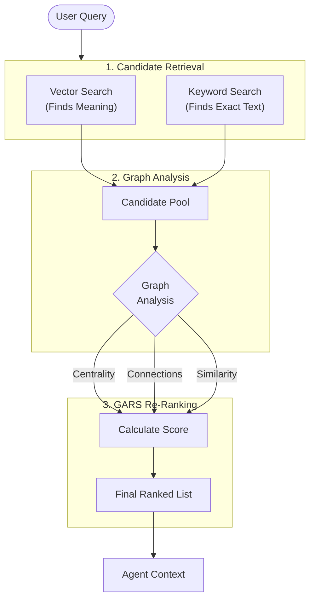

# The Research Engine

Understanding how Vault Intelligence finds, ranks, and synthesizes information from your notes.

## Hybrid Search Architecture

The Researcher uses a three-stage pipeline to ensure it finds relevant information even if you use different terminology than your notes.

## GARS: Graph-Augmented Relevance Score

Most RAG (Retrieval-Augmented Generation) systems only look at similarity (text matching). Vault Intelligence adds two critical dimensions:

1.  Similarity: Does the note text match the query?
2.  Centrality: Is this note a "hub" or "authority" in your vault structure?
3.  Activation: Is this note connected to other relevant notes?

This ensures that a core definition note (eg "Project Alpha MOC") ranks higher than a random daily log mentioning "Project Alpha", even if the daily log has more keyword matches.

## Visual Grounding

Vault Intelligence provides spatial context for the Researcher's reasoning through the Semantic Galaxy.

1.  Analysis: The agent identifies notes that support its answer.
2.  Projection: These notes are automatically highlighted in the 3D-like galaxy view.
3.  Discovery: You can see not just the cited notes, but also the cluster of related ideas physically surrounding them, helping you verify the agent's logic at a glance.

## Privacy and processing

-   Local Indexing: Your vault's search index is built and stored entirely on your device (`data/` folder).
-   Cloud Reasoning: When you chat, only the relevant snippets of text (found by the local index) are sent to the Google Gemini API for answer generation.
-   No Training: Data sent to the API is used strictly for generating the response and is not used to train Google's models.
