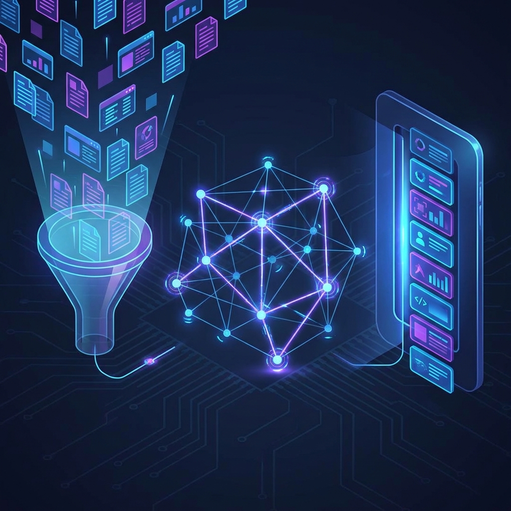

# Research Assistant Guide

The Research Assistant is your intelligent partner embedded within your Obsidian vault. Unlike simple search tools, it uses a sophisticated multi-stage engine to understand *meaning*, *structure*, and *connections* before generating an answer.

## Using the Researcher

The Researcher lives in the right sidebar (default) and functions like a chat interface.

### Core Capabilities

1.  **Vault Search**: It finds notes based on meaning (semantic search), not just keywords.
2.  **Graph Awareness**: It understands how your notes are connected. If Note A answers your question but Note B is heavily linked to it, the Researcher sees that relationship.
3.  **Google Search**: It can verify facts, check dates, or look up recent events using Google Search (if API key is provided).
4.  **Multi-Step Reasoning**: For complex questions, the agent will "think" in loops—searching, reading, refining its plan, and searching again.

### Best Practices

-   **Be Specific**: "What are the key concepts in Project Alpha?" is better than "Project Alpha".
-   **Use @ Mentions**: You can explicitly add a note to the context by typing `@` and selecting it (e.g., "Summarise this note: @MeetingNotes").
-   **Iterate**: If the answer is too broad, ask a follow-up: "Focus specifically on the budget section."

## The Engine: Hybrid Search & GARS

Under the hood, Vault Intelligence uses a three-stage engine to find the most relevant information.



```mermaid
graph TD
    UserQuery([User Query]) --> Stage1
    
    subgraph Stage1 [1. Candidate Retrieval]
        Vector[Vector Search\n(Finds Meaning)]
        Keyword[Keyword Search\n(Finds Exact Text)]
    end
    
    Vector --> Pool
    Keyword --> Pool
    
    subgraph Stage2 [2. Graph Analysis]
        Pool[Candidate Pool] --> Evaluation
        Evaluation{Graph\nAnalysis}
    end
    
    Evaluation -- Centrality --> GARS
    Evaluation -- Connections --> GARS
    Evaluation -- Similarity --> GARS
    
    subgraph Stage3 [3. GARS Re-Ranking]
        GARS[Calculate Score] --> Ranked[Final Ranked List]
    end
    
    Ranked --> Agent[Agent Context]
```

### What is GARS?

**GARS (Graph-Augmented Relevance Score)** is the secret sauce. It doesn't just look at text; it looks at importance. A note becomes "relevant" if:

1.  **Similarity**: It matches your query text (Standard Search).
2.  **Centrality**: It is a "hub" or important note in your vault (Structural Importance).
3.  **Activation**: It is directly connected to *other* notes that matched your query (Contextual Relevance).

## Tuning GARS (Advanced)

You can tune how the engine "thinks" about relevance in **Settings > Advanced > Search relevance tuning**.

### The Mental Model

Think of these sliders as telling the engine what you value most right now.

| Weight | Mental Model | Best For... |
| :--- | :--- | :--- |
| **Similarity** | *"I want to see notes that contain these exact words or concepts."* | Finding specific facts, definitions, or exact quotes. |
| **Centrality** | *"I want to see the most important 'Hub' notes first."* | exploring broad topics where you want to start with the "Main" note (MOC) rather than a detail note. |
| **Activation** | *"I want to see how these ideas connect."* | Deep research where finding the "missing link" between two ideas is more important than a direct keyword match. |

### Common Configurations

**1. The Librarian (Default)**

-   Similarity: 0.60
-   Centrality: 0.20
-   Activation: 0.20

*Balanced approach. Good for general questions.*

**2. The Explorer**

-   Similarity: 0.40
-   Centrality: 0.10
-   Activation: 0.50

*Prioritizes connections. Great for finding "hidden gems" or related concepts that don't explicitly mention your keywords.*

**3. The Fact-Checker**

-   Similarity: 0.90
-   Centrality: 0.05
-   Activation: 0.05

*Strict. Only returns notes that strongly match the query. Good when you know exactly what you are looking for.*

> [!NOTE] TODO: Screenshots needed
> I need screenshots to verify the new UI elements:
> 1.  **Researcher View**: Showing a chat with hybrid search results.
> 2.  **GARS Tuning Panel**: The new settings section with sliders.
> 
> *Users: Please create a GitHub issue if you can help provide these!*
